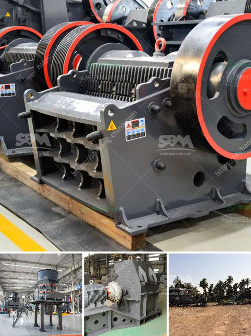

<h3>small conveyor belt to move coal for home use</h3>
Title: Introducing Small Conveyor Belts for Home Use: An Innovative Solution to Move Coal Efficiently

As the demand for alternative heating sources grows, many homeowners are turning to coal as an affordable and efficient option. However, one common challenge that arises when using coal for home heating is the bulk transportation and movement of this fuel indoors. To tackle this issue, the development of small conveyor belts for home use has emerged as an innovative solution. In this article, we will explore the benefits and applications of small conveyor belts in moving coal effortlessly within residential settings.

Small conveyor belts designed for home use offer a convenient and efficient method of transferring coal from a designated storage area to the furnace or stove. These compact and lightweight systems can easily handle the weight and volume of coal without causing strain on the user. With an automated design, homeowners can focus on other tasks, as the conveyor belt smoothly transports the fuel.

Limited space is always a concern in residential settings. Small conveyor belts effectively address this issue by occupying a minimal footprint. Their slim profile allows them to be easily integrated into existing coal storage setups, ensuring optimal utilization of available space. Moreover, their modular design enables customization as per the specific needs of each homeowner.

Coal transportation can be a messy affair, posing risks such as back strain, dust exposure, and the potential for accidental spills. Small conveyor belts are equipped with safety features to mitigate these risks. Enclosed belts prevent coal particles from dispersing into the environment, enhancing air quality and reducing health hazards. Additionally, adjustable speed controls improve handling, ensuring a steady and safe flow of coal.

Small conveyor belts for home use are often constructed with high-quality materials, ensuring their durability and longevity. They are built to withstand the demands of moving coal, such as heat, weight, and continuous operation. With minimal maintenance requirements, these conveyor belts are designed to provide homeowners with a hassle-free experience.

Beyond coal transportation, small conveyor belts offer a range of applications for homeowners. These systems can effectively move other materials such as firewood, pellets, or even groceries from a basement or garage up to living areas. Their versatility allows homeowners to utilize them for various tasks, increasing their value and usefulness beyond their primary purpose.

Investing in a small conveyor belt for home use is a cost-effective decision in the long run. Not only do these systems save time and effort, but they also provide peace of mind when it comes to fuel transportation. With reduced manual labor and improved efficiency, homeowners can optimize fuel consumption, leading to potential cost savings.

The introduction of small conveyor belts for home use revolutionizes the way coal is transported within residential settings. These systems offer unparalleled convenience, safety, and efficiency by automating the coal movement from storage to the heating appliance. With their space-saving design and versatility, small conveyor belts can be customized to fit individual needs, making them an essential addition to modern coal-burning households. Embracing this innovative solution ensures a seamless, clean, and stress-free experience for homeowners relying on coal as a heating source.
<h3>Contact us</h3><ul><li><strong>Whatsapp:&nbsp;<a href="https://wa.me/8613661969651">+8613661969651</a></strong></li><li><a href="https://swt.shibang-china.com/?git&amp;zhl&amp;small conveyor belt to move coal for home use"><strong>Online Service(chat now)</strong></a></li></ul><h3>Related</h3><ul><li><a href='crsusher plant in the philippines.md'>crsusher plant in the philippines</a></li><li><a href='lime powder marking machines.md'>lime powder marking machines</a></li><li><a href='used mobile jaw crushers for sale in uae.md'>used mobile jaw crushers for sale in uae</a></li><li><a href='stone crushing machine for sale in uganda.md'>stone crushing machine for sale in uganda</a></li><li><a href='stone crusher for sale philippine.md'>stone crusher for sale philippine</a></li></ul>