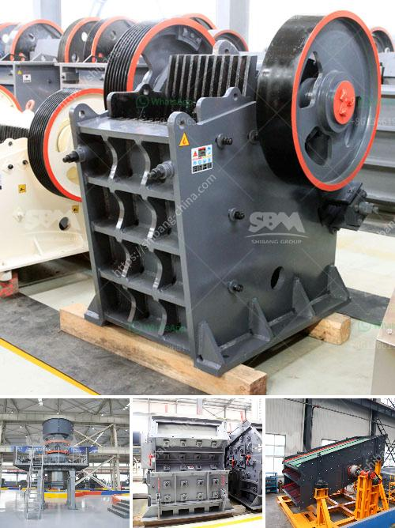

<h3>small gold crushing plant for sale</h3>
Gold mining is the extraction of gold particles or gold nuggets from the ground. Gold has been a valuable and highly sought-after precious metal for centuries. It has been used in jewelry, money, and as a store of wealth for individuals and nations. Nowadays, gold mining involves various techniques to extract gold from the earth. One of the methods used is rock crushing, where a small gold crushing plant is used to crush rocks into smaller particles before further processing.

A small gold crushing plant consists of a jaw crusher, roller crusher and cone crusher. These machines are used to crush the gold-bearing rocks into smaller particles or powders for further processing. Depending on the hardness of the gold ore, a combination of crushing techniques is used. For softer ores, such as placer deposits, a jaw crusher is often used. For harder ores, a cone crusher or roller crusher may be used.

The jaw crusher is used to crush the gold ore into smaller particles. It has a stationary jaw and a movable jaw, which form a crushing chamber. The movable jaw exerts force against the fixed jaw, crushing the gold ore. The crushed ore is then transported to a roller crusher or cone crusher.

The roller crusher is used to further crush the gold ore into even smaller particles. It consists of two or more rotating drums with large teeth on the outer surface. The gold ore is fed into the crusher and the rotating drums crush and grind it into smaller particles. The smaller particles are then transported to a cone crusher for further crushing.

The cone crusher is used to crush the gold ore into even smaller particles. It consists of a fixed cone and a movable cone. The gold ore is fed into the crusher and the movable cone exerts force against the fixed cone, crushing the gold ore. The crushed ore is then transported to a vibrating screen for further separation.

After crushing, the gold ore is processed to extract the gold. Several techniques can be used, such as gravity separation, flotation, and leaching. Gravity separation is the most common method used to extract gold from crushed ore. Gold particles are heavier than other particles and can be separated by shaking or by using a centrifugal concentrator. Flotation is used when the gold ore has a high sulfide content. The ore is mixed with water and chemicals, and air bubbles are introduced. The gold particles attach to the air bubbles and float to the surface, where they are collected. Leaching is used when the gold ore is finely crushed. The crushed ore is mixed with a cyanide solution, which dissolves the gold. The gold-containing solution is then collected and the gold is precipitated out.

A small gold crushing plant can be a profitable investment for individual prospectors or small-scale miners. It allows them to process gold-bearing rocks and extract the gold. With advancements in technology, small gold crushing plants can be operated in remote areas or even in a home-based setup. They are portable and can be easily transported to different locations.

In conclusion, a small gold crushing plant is an essential piece of equipment for any gold miner to have. It allows them to crush rocks and extract the gold, which can then be further processed. Whether for personal use or for commercial purposes, a small gold crushing plant can be a valuable asset.
<h3>Contact us</h3><ul><li><strong>Whatsapp:&nbsp;<a href="https://wa.me/8613661969651">+8613661969651</a></strong></li><li><a href="https://swt.shibang-china.com/?git&amp;zhl&amp;small gold crushing plant for sale"><strong>Online Service(chat now)</strong></a></li></ul><h3>Related</h3><ul><li><a href='crusher plant project report pdf.md'>crusher plant project report pdf</a></li><li><a href='mini sandstone crusher price.md'>mini sandstone crusher price</a></li><li><a href='mobile stone crusher south africa.md'>mobile stone crusher south africa</a></li><li><a href='netherlands impact crushers.md'>netherlands impact crushers</a></li><li><a href='construction conveyor for sale.md'>construction conveyor for sale</a></li></ul>