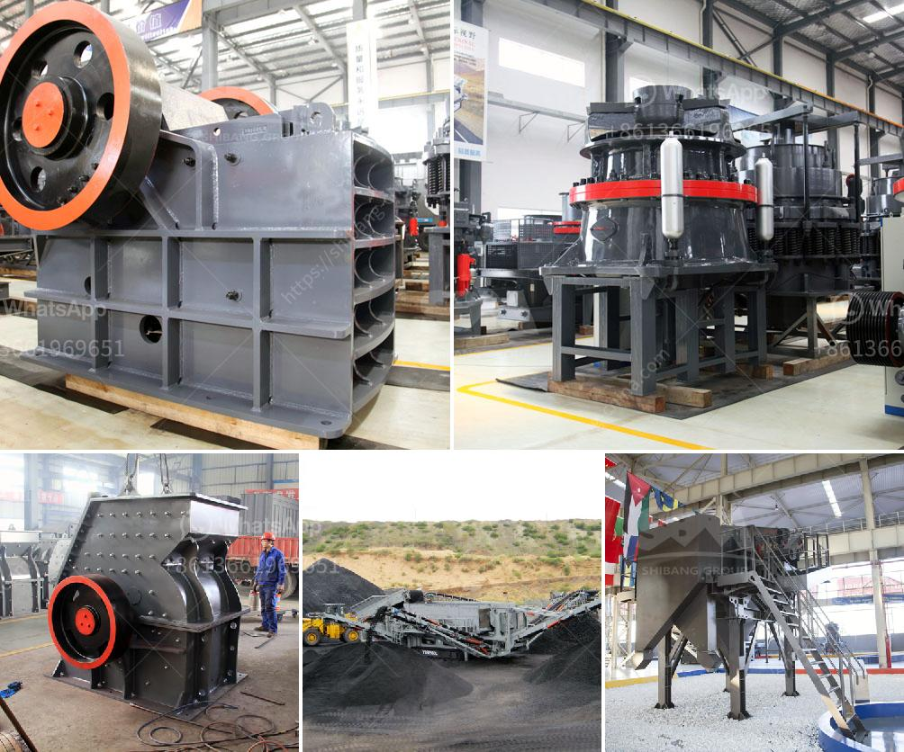

<h3>small gold rock crushers with chain</h3>
Crushing rocks is an integral part of many industries around the world. These machines, commonly referred to as rock crushers, have gained popularity over the years and are widely used in various applications. However, not all rock crushers are created equal. In this article, we will explore the small gold rock crushers with chain, specifically designed for extracting gold from rocks.

One of the key features of these gold rock crushers is the chain. Unlike traditional hammer mills that feature a high-speed rotor, this type of rock crusher uses chains instead of hammers. A recent development in rock crusher design is a unit that incorporates chains to break the rock into shards so they can be easily processed. The chains are commonly used in place of hammers as they provide a better grip and can withstand the intense pressure that comes from crushing rocks.

The small gold rock crushers with chain are ideal for prospectors looking to extract gold from rocks quickly and efficiently. It is also a useful tool for miners working in remote areas where they don't have access to large hammer mills. These crushers are designed to crush ore quickly and safely, and can be adjusted to create different-sized rocks according to the user's needs.

Apart from their effectiveness, these small gold rock crushers with chain are also portable and lightweight, making them easy to transport and use in various locations. Whether you are a hobbyist or a professional miner, these crushers can be your reliable companion in extracting gold from rocks.

When purchasing a small gold rock crusher with chain, it is important to consider factors such as the size of the rocks you will be crushing, the desired output size, and the power source available to you. Additionally, it is always advisable to choose a reputable manufacturer that can provide you with high-quality and durable equipment.

In conclusion, small gold rock crushers with chain are a valuable tool for prospectors and miners alike. Their portability and efficiency make them an excellent choice for extracting gold from rocks. Whether you are a hobbyist or a professional, these crushers will undoubtedly enhance your productivity and success in the gold mining industry.
<h3>Contact us</h3><ul><li><strong>Whatsapp:&nbsp;<a href="https://wa.me/8613661969651">+8613661969651</a></strong></li><li><a href="https://swt.shibang-china.com/?git&amp;zhl&amp;small gold rock crushers with chain"><strong>Online Service(chat now)</strong></a></li></ul><h3>Related</h3><ul><li><a href='gemstone mining in zambia.md'>gemstone mining in zambia</a></li><li><a href='mobile stone crushers in usa.md'>mobile stone crushers in usa</a></li><li><a href='2nd hand mobile crusher in dubai.md'>2nd hand mobile crusher in dubai</a></li><li><a href='list of stone crusher plant in bangladesh.md'>list of stone crusher plant in bangladesh</a></li><li><a href='crushing and screening plant supplier china.md'>crushing and screening plant supplier china</a></li></ul>