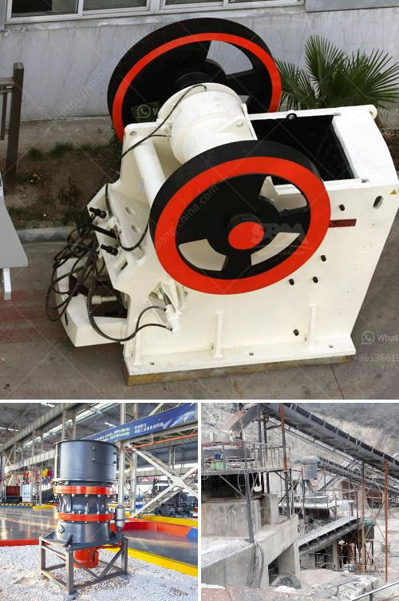

<h3>small grinding machine for limestone</h3>
Limestone is a common rock found in nature. It is mainly composed of calcium carbonate, making it an excellent choice for industrial and agricultural applications. Limestone has a variety of uses, ranging from building materials to animal feed and even cosmetics. To meet the demands of these diverse applications, limestone undergoes a grinding process to obtain the desired particle size. A small grinding machine for limestone, however, can greatly simplify the process and increase efficiency.

When limestone is mined from the earth, it is crushed and prepared for further processing. Some limestone undergoes a heating and grinding process (called calcining) to form quicklime, while other types of limestone are ground into a powder and used as a filler or additive in various products. A small grinding machine for limestone offers a compact size, reducing the footprint required for the grinding process.

Smaller limestone grinding machines can also save on labor costs, as they require fewer operators to run them. With automated controls, these machines can be programmed to perform tasks with minimal human intervention – increasing productivity and reducing the risk of errors.

One type of small grinding machine for limestone is the ball mill. It is a cylindrical device used to grind or mix materials like ores, chemicals, ceramic raw materials, and paints. The ball mills rotate around a horizontal axis, partially filled with the material to be ground plus the grinding medium. Different materials are used as media, including ceramic balls, flint pebbles, and stainless steel balls. The smaller the media, the finer the grinding process.

Another type of small grinding machine for limestone is the vertical roller mill. It is essentially a sophisticated large-scale version of the ball mill. With additional vertical grinding surfaces, it can handle larger quantities of material and produce finer particles.

These small grinding machines provide several advantages over traditional methods. First and foremost, they are more efficient, allowing for faster processing times and increased output. Their compact size makes them ideal for businesses with limited space. Additionally, they require less power, contributing to lower energy consumption and reduced operating costs.

In conclusion, a small grinding machine for limestone is an essential investment for any business that requires the grinding of limestone. These machines provide numerous advantages over traditional methods, saving time, space, and labor costs. Their smaller size also results in a reduced environmental footprint. With advancements in technology, small grinding machines are becoming even more efficient and cost-effective, making them an attractive option for limestone processing needs.
<h3>Contact us</h3><ul><li><strong>Whatsapp:&nbsp;<a href="https://wa.me/8613661969651">+8613661969651</a></strong></li><li><a href="https://swt.shibang-china.com/?git&amp;zhl&amp;small grinding machine for limestone"><strong>Online Service(chat now)</strong></a></li></ul><h3>Related</h3><ul><li><a href='nigeira mobile crushing plant.md'>nigeira mobile crushing plant</a></li><li><a href='horizontally ball mill production russia.md'>horizontally ball mill production russia</a></li><li><a href='crusher plant manufacturer.md'>crusher plant manufacturer</a></li><li><a href='slag crushing machinery supplier from india.md'>slag crushing machinery supplier from india</a></li><li><a href='costs for a stone crusher plant.md'>costs for a stone crusher plant</a></li></ul>