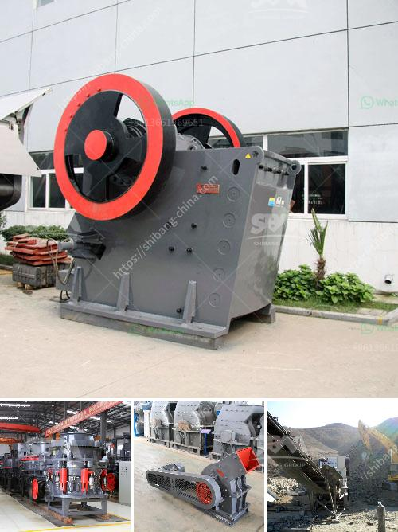

<h3>small gypsum crushing machines australia</h3>
Gypsum is a plentiful mineral widely used in various industries around the world. As gypsum rock is mined or quarried, it undergoes a complex process that involves crushing, screening, and grinding to turn it into a fine powder. Gypsum powder is then used as an essential additive in various construction materials, such as plasterboard, drywall, and cement. In Australia, where construction waste is a significant concern, small gypsum crushing machines have emerged as a solution for recycling this waste product.

Australia produces around 3 million tons of gypsum waste annually, with most of it ending up in landfills. The disposal of gypsum waste not only takes up valuable landfill space but also contributes to environmental pollution. Moreover, gypsum waste can leach harmful substances into the soil and water sources, posing a threat to both human health and the ecosystem.

To combat these issues, small gypsum crushing machines have become an ideal choice for recycling gypsum waste in Australia. These machines are compact and easy to operate, making them suitable for small-scale recycling projects carried out by construction companies or individual contractors.

One such machine is the small gypsum crushing machine. It consists of a crushing chamber, feeder, motor, and drive system. The crushing chamber contains fixed blades that rotate and grind the gypsum waste into smaller particles. The feeder ensures a continuous feed of gypsum waste, allowing for efficient crushing.

Another popular machine in Australia is the small hammer mill. This machine uses rotating hammers to crush the gypsum waste into uniform particles. The hammer mill is equipped with screens that control the particle size and ensure a consistent product.

These small gypsum crushing machines not only help recycle gypsum waste but also offer economic benefits to contractors and construction companies. By recycling gypsum waste, companies can reduce their disposal costs, as landfill charges are typically high. Additionally, some recycling facilities may offer monetary incentives or tax benefits for recycling gypsum waste.

Furthermore, using recycled gypsum in construction materials can reduce the overall production costs. Gypsum is an essential component in many construction products, and by recycling it, manufacturers can reduce their raw material expenses. This, in turn, can lead to more affordable construction materials for consumers.

Small gypsum crushing machines in Australia are also environmentally friendly. By recycling gypsum waste, the demand for virgin gypsum mining reduces, which has its own environmental implications. Mining gypsum has a considerable impact on natural resources, as it requires extensive land excavation and contributes to soil erosion.

In conclusion, small gypsum crushing machines have provided Australia with an effective solution for recycling gypsum waste. These machines not only reduce the environmental impact of gypsum waste disposal but also offer economic benefits to construction companies. By embracing these small machines, Australia can address its construction waste challenges while promoting sustainability and resource conservation in the construction industry.
<h3>Contact us</h3><ul><li><strong>Whatsapp:&nbsp;<a href="https://wa.me/8613661969651">+8613661969651</a></strong></li><li><a href="https://swt.shibang-china.com/?git&amp;zhl&amp;small gypsum crushing machines australia"><strong>Online Service(chat now)</strong></a></li></ul><h3>Related</h3><ul><li><a href='mobile quarry crushing plant price in jamaica.md'>mobile quarry crushing plant price in jamaica</a></li><li><a href='copper concentrate plant manufacturers in south africa.md'>copper concentrate plant manufacturers in south africa</a></li><li><a href='size ball mills for miner.md'>size ball mills for miner</a></li><li><a href='crushed stone sorting machinery.md'>crushed stone sorting machinery</a></li><li><a href='mobile stone crusher gauteng.md'>mobile stone crusher gauteng</a></li></ul>