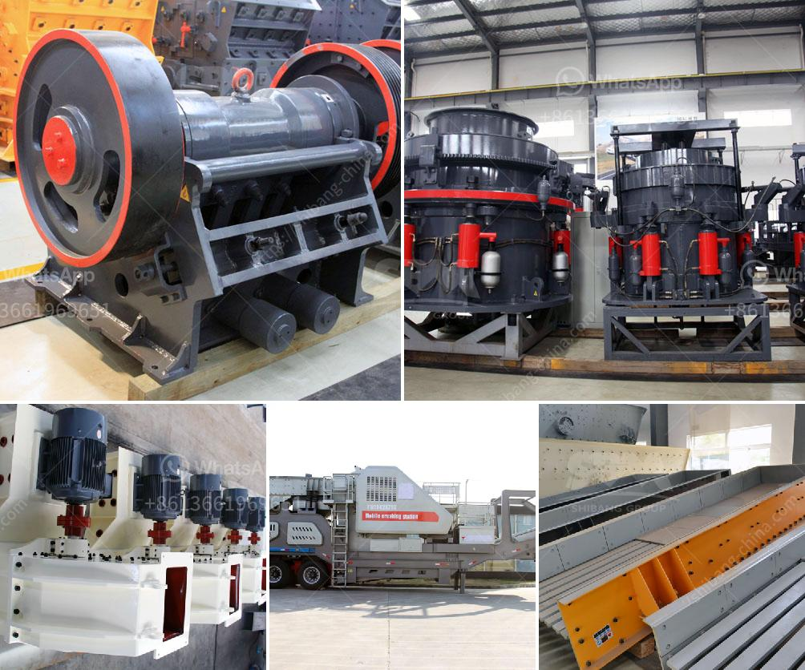

<h3>small jaw crusher for sale south africa</h3>
Are you in need of a small jaw crusher for sale in South Africa? You are not alone. South Africa is home to an array of mine operations, ranging from the gold and diamond mines deep underground to the platinum and coal mines on the surface. Some of the country's most vital minerals are mined here, and extracting them requires powerful and reliable equipment.

One essential piece of equipment for the mining industry is the jaw crusher, a machine that breaks down tough materials into smaller pieces. The jaw crusher is an excellent primary crusher and can efficiently crush hard and abrasive materials. It is also capable of processing large feed sizes, making it ideal for use in mining operations.

If you are in the market for a jaw crusher, you may have come across the popular models available in South Africa. These include the Nordberg C96 jaw crusher, which is a popular choice for primary crushing, and the Nordberg C130 jaw crusher, which boasts excellent size reduction capabilities.

While these jaw crushers are widely used in the mining industry, not everyone can afford to buy them. Therefore, finding a small jaw crusher for sale in South Africa is crucial to meeting the crushing demands in the mining industry.

Recently, it was announced that the small jaw crusher is available for sale in South Africa. Many people in the industry have been waiting for this news and now the opportunity to own one is within reach. The small jaw crusher is a powerful piece of equipment that can be used when crushing ore, rock, or other materials. It is commonly used in mining operations and can be set up to process a variety of materials, including stone and minerals.

What makes the small jaw crusher an excellent choice is its high crushing ratio and efficiency, which allows it to crush even the hardest materials. Additionally, it has a compact design, making it perfect for use in constrained spaces and easily transportable between different project sites.

Another advantage of the small jaw crusher is its affordability. As compared to larger jaw crushers, the small jaw crusher for sale in South Africa is relatively cheaper. This affordability makes it an ideal choice for small-scale entrepreneurs in the mining industry.

Cheap prices typically mean low quality, but that is not the case with the small jaw crusher for sale in South Africa. These units are built to last, with high-quality parts and materials ensuring their longevity. In addition, they are equipped with advanced technology to enhance their performance and provide the best results.

Overall, the availability of a small jaw crusher for sale in South Africa should be seen as a game-changer for the mining industry. It is guaranteed to improve the efficiency and productivity of mining operations by enabling the crushing of materials on-site. This saves time and money, as there is no need to transport the materials to a separate crushing plant.

In conclusion, if you are in the mining industry in South Africa, investing in a small jaw crusher is a smart decision. It offers numerous benefits, including affordability, compact design, and high crushing efficiency. With a small jaw crusher, you can process materials on-site, reducing transportation costs and improving overall productivity. So, don't miss the opportunity to own this essential piece of equipment and take your mining operation to the next level.
<h3>Contact us</h3><ul><li><strong>Whatsapp:&nbsp;<a href="https://wa.me/8613661969651">+8613661969651</a></strong></li><li><a href="https://swt.shibang-china.com/?git&amp;zhl&amp;small jaw crusher for sale south africa"><strong>Online Service(chat now)</strong></a></li></ul><h3>Related</h3><ul><li><a href='used clinker grinding mill for sale.md'>used clinker grinding mill for sale</a></li><li><a href='mobile crusher rent uae.md'>mobile crusher rent uae</a></li><li><a href='400 tph mobile coal crusher plant manufacturer.md'>400 tph mobile coal crusher plant manufacturer</a></li><li><a href='used mobile jaw crusher dealers in ghana.md'>used mobile jaw crusher dealers in ghana</a></li><li><a href='machinery used in cement factory.md'>machinery used in cement factory</a></li></ul>