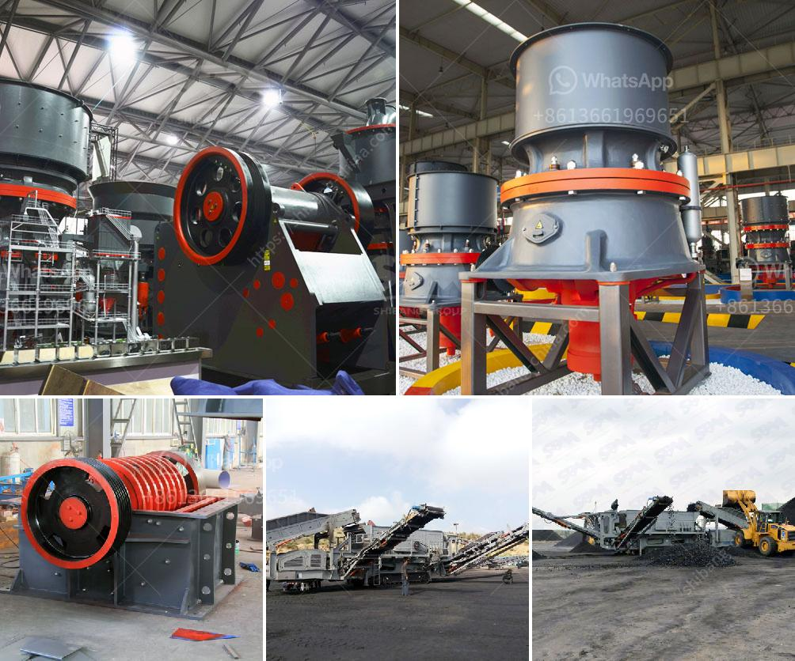

<h3>small rock crusher machine in india</h3>
India is rich in mineral resources and it is one of the fastest growing countries in terms of GDP. The country's industrial sectors contribute significantly to the nation's economy, offering numerous employment opportunities for skilled and unskilled labor. With the growing infrastructure and construction projects, the demand for sand, crushed stones, and gravel is also on the rise. This has led to an increased need for rock crushers in India.

A rock crusher is a machine used to crush rocks into smaller pieces, usually for gravel or some other road or building application. Most rock crushers have a hopper at the top, a container which holds the rock above the crusher and uses gravity to feed it in. Alternately, rock crushers can use a belt drive to continuously transport the rock into the crusher.

Rock crushers are versatile machines that can be used for a variety of purposes. For example, the Cobra 230R rock crusher is a versatile and easy-to-use machine that can crush and recycle construction and demolition waste, asphalt, concrete, and other materials. Its compact size and ability to maneuver easily makes it perfect for small to medium-sized construction sites.

In India, many construction and demolition projects generate a substantial amount of waste, which can be recycled and used for other purposes. By using a rock crusher, contractors can recycle the waste material, reducing the need for new aggregates and saving disposal costs.

The process of crushing rocks with a rock crusher is relatively simple. Once the rock is placed into the hopper, it is then crushed using either compression or impact forces. Compression crushing involves placing the rock between two surfaces and applying pressure to break it into smaller pieces. Impact crushing, on the other hand, uses rapid impacts to break the rock into smaller fragments.

There are several types of rock crushers available in the market, each with its own specific features and advantages. Some rock crushers are stationary while others are mobile, allowing them to be easily transported to different construction sites. Mobile rock crushers are especially popular in India, where the infrastructure and road networks are still developing.

Small rock crushers are ideal for the construction industry. They are affordable and can break down large rocks into smaller pieces quickly and efficiently. The small size also allows for easier transportation between construction sites. Furthermore, these crushers are more environmentally friendly as they require less energy to operate compared to larger rock crushers.

In conclusion, the demand for rock crushers in India is on the rise, as construction and demolition projects continue to grow. Whether it is for recycling waste material or for building new structures, rock crushers play a crucial role in the construction industry. Small rock crushers offer an affordable solution for contractors, allowing them to efficiently crush rocks and recycle materials. With the increasing focus on sustainable construction practices, these machines are becoming more popular and widely used in India.
<h3>Contact us</h3><ul><li><strong>Whatsapp:&nbsp;<a href="https://wa.me/8613661969651">+8613661969651</a></strong></li><li><a href="https://swt.shibang-china.com/?git&amp;zhl&amp;small rock crusher machine in india"><strong>Online Service(chat now)</strong></a></li></ul><h3>Related</h3><ul><li><a href='calcium carbonate plant manufacturers.md'>calcium carbonate plant manufacturers</a></li><li><a href='hammer mills grinding.md'>hammer mills grinding</a></li><li><a href='layoutde a crusher machine.md'>layoutde a crusher machine</a></li><li><a href='horizontally ball mill production russia.md'>horizontally ball mill production russia</a></li><li><a href='jaw crusher adaptable extec coal russian.md'>jaw crusher adaptable extec coal russian</a></li></ul>