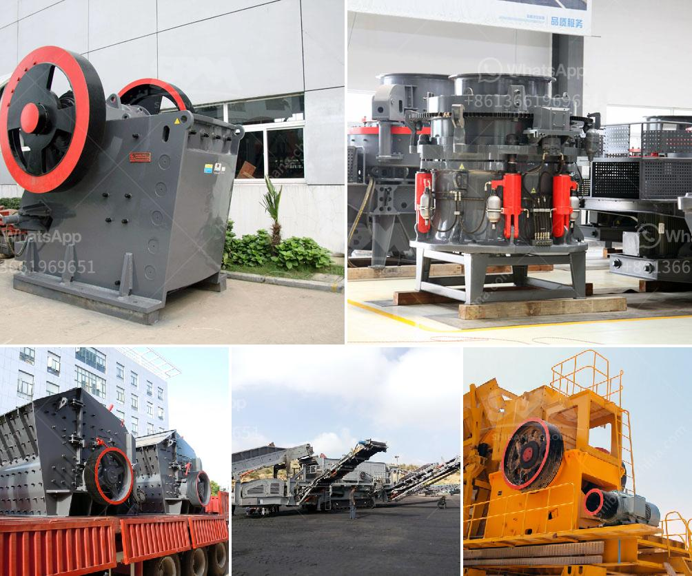

<h3>small scale mine business plan pdf</h3>
Small scale mining is a crucial sector in the mining industry. It plays a significant role in poverty alleviation, job creation, and natural resource management. Despite its potential, small scale mining often faces numerous challenges, particularly in developing countries.

To address these challenges and ensure the sustainability of small scale mining operations, a well-crafted business plan is essential. A business plan serves as a roadmap that outlines the objectives, strategies, and financial projections of a mining venture.

In a small scale mine business plan PDF, several key elements should be considered. Firstly, a clear description of the mining operation, including details such as the type of minerals being mined, the scale and method of mining, and the geographical location of the mine.

Secondly, the plan should include a comprehensive market analysis to identify potential buyers and competitors in the industry. This analysis should also highlight the demand and supply dynamics, pricing trends, and the regulatory environment.

Furthermore, the business plan should outline the operational strategy, including the equipment and machinery required for mining activities, as well as the logistics and transportation arrangements. It should also address environmental and social considerations, ensuring that responsible mining practices are adhered to.

Financial projections are a crucial component of any business plan. It should include estimates of capital investment, operational costs, and revenue projections over a specified period. This will help investors and stakeholders understand the potential profitability and return on investment of the mining venture.

A small scale mine business plan PDF should also include risk assessment and mitigation strategies. Mining operations often face numerous risks, such as geological uncertainties, regulatory challenges, and market volatility. Identifying these risks and outlining strategies to address them will enhance the chances of success.

In conclusion, a well-designed small scale mine business plan PDF is crucial for the sustainable development of small scale mining ventures. It provides a framework for effective decision-making and allows investors and stakeholders to assess the viability and profitability of the venture. With proper planning and execution, small scale mining can contribute to economic growth and poverty reduction in mining communities.
<h3>Contact us</h3><ul><li><strong>Whatsapp:&nbsp;<a href="https://wa.me/8613661969651">+8613661969651</a></strong></li><li><a href="https://swt.shibang-china.com/?git&amp;zhl&amp;small scale mine business plan pdf"><strong>Online Service(chat now)</strong></a></li></ul><h3>Related</h3><ul><li><a href='hand operated rock crusher.md'>hand operated rock crusher</a></li><li><a href='large volume conveyor belt systems rentals.md'>large volume conveyor belt systems rentals</a></li><li><a href='utiliza equipos de molienda fina molino.md'>utiliza equipos de molienda fina molino</a></li><li><a href='difference between horizontal milling machine.md'>difference between horizontal milling machine</a></li><li><a href='top aggregate crusher suppliers in south africa.md'>top aggregate crusher suppliers in south africa</a></li></ul>