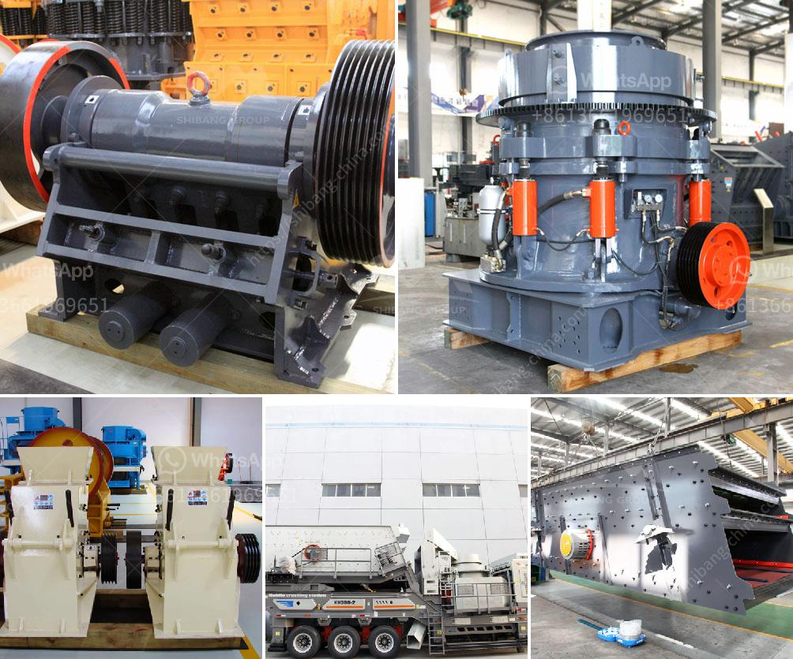

<h3>small scale quarry stone making machine</h3>
The quarry stone making machine is a device that is utilized to crush rocks into smaller pieces, typically used for gravel or road construction. Small-scale quarry stone making machines are preferred by most businesses because of their lower costs, efficiency, and ease of operation. These machines are crucial for small-scale quarry operations, as they can process materials more efficiently, resulting in increased productivity. In this article, we will explore the benefits of small-scale quarry stone making machines and how they have become a game changer in the industry.

One of the significant advantages of small-scale quarry stone making machines is their affordability. Unlike larger scale machines that require significant capital to purchase and maintain, small-scale machines are more accessible to small business owners or entrepreneurs with limited resources. These machines offer the opportunity for smaller quarries to enter the market without breaking the bank. By investing in a small-scale quarry stone making machine, entrepreneurs can acquire the necessary equipment needed for their operations and start generating income.

Moreover, small-scale quarry stone making machines are designed for efficient operation. These machines have well-engineered features that optimize the crushing process, resulting in higher production rates and lower energy consumption. The precision in their design allows for controlled and consistent output sizes, ensuring the quality of the crushed materials. This level of efficiency enables small-scale quarries to meet customer demand promptly and maintain a competitive edge in the market.

In addition to efficiency, small-scale quarry stone making machines offer ease of operation. They are user-friendly and require minimal training for operators to get acquainted with the machine's functions. The straightforward design also simplifies maintenance and repairs, reducing downtime and enhancing overall productivity. Small-scale quarry owners can focus on running their operations smoothly without worrying about complex machinery that requires specialized expertise.

Furthermore, small-scale quarry stone making machines are environmentally friendly. These machines are often designed to minimize noise and dust emissions. By using advanced technology, such as dust collectors and noise reduction measures, these machines significantly reduce the negative impact on the environment and create a safer working environment for employees. This eco-friendly feature is increasingly important as sustainability becomes a primary concern for many businesses and consumers.

The introduction of small-scale quarry stone making machines has revolutionized the industry. These machines have leveled the playing field for small-scale quarry owners, allowing them to compete with larger operations. They provide affordable, efficient, and user-friendly solutions, enabling smaller businesses to thrive and contribute to the construction industry. The increased accessibility to these machines has opened up new avenues for entrepreneurs, encouraging innovation and economic growth.

To conclude, small-scale quarry stone making machines have brought immense benefits to the industry. Their affordability, efficiency, ease of operation, and eco-friendly features make them an ideal choice for small-scale quarry operations. As the demand for construction materials continues to rise, small-scale quarry owners can rely on these machines to meet customer needs and contribute to the overall development of the industry. The game-changing impact of small-scale quarry stone making machines ensures a promising future for this sector.
<h3>Contact us</h3><ul><li><strong>Whatsapp:&nbsp;<a href="https://wa.me/8613661969651">+8613661969651</a></strong></li><li><a href="https://swt.shibang-china.com/?git&amp;zhl&amp;small scale quarry stone making machine"><strong>Online Service(chat now)</strong></a></li></ul><h3>Related</h3><ul><li><a href='gold mining wash plants for sale in ghana.md'>gold mining wash plants for sale in ghana</a></li><li><a href='quartz powder plant in india.md'>quartz powder plant in india</a></li><li><a href='conveyor belts in opracion.md'>conveyor belts in opracion</a></li><li><a href='hammer mill peru.md'>hammer mill peru</a></li><li><a href='sand making machine indonesia.md'>sand making machine indonesia</a></li></ul>