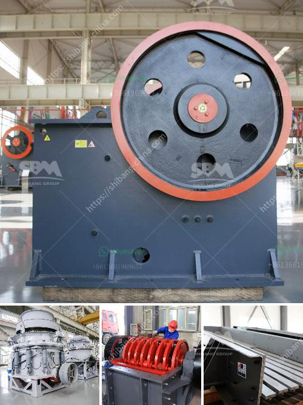

<h3>small scale rock grizzly separator</h3>
A small scale rock grizzly separator is a valuable piece of equipment that can enhance the efficiency of various mining and construction projects. It is designed to extract and separate large rocks and debris from the soil, allowing for a cleaner and more manageable work environment. In this article, we will explore the benefits and functionality of a small scale rock grizzly separator.

First and foremost, a rock grizzly separator serves as a protective device to prevent any damage to crushers, screens, and conveyors during the material handling process. It acts as a primary screening tool, removing oversized materials such as rocks, boulders, and construction debris, ensuring that only the desired particles enter the subsequent stages of processing.

One of the key advantages of a small scale rock grizzly separator is its simplicity in design and operation. It typically consists of a series of parallel bars or rails spaced at specific intervals. These bars are usually made of sturdy steel or other durable materials to withstand heavy-duty applications. As the material is fed onto the grizzly separator, the larger particles are caught and separated, diverting them away from the rest of the material flow.

Another significant benefit of a rock grizzly separator is its ability to increase productivity and efficiency on job sites. By removing oversized materials, the separator eliminates the need for manual handling or additional screening processes, saving valuable time and resources. With the grizzly separator in place, operators can focus on processing the desired materials without the hassle of constantly removing and disposing of large rocks or debris.

Moreover, using a small scale rock grizzly separator contributes to a safer work environment. The removal of oversized materials reduces the risk of accidents and injuries caused by falling rocks or equipment malfunctioning due to excessive load. It also minimizes the likelihood of blockages in crushers and screens, which can potentially cause equipment damage or lead to shutdowns.

Furthermore, a rock grizzly separator is highly adaptable and can be easily integrated into existing production lines or incorporated into mobile crushing and screening plants. It can be customized based on specific requirements, such as the desired separation size or the nature of the material being processed. This flexibility makes it suitable for a wide range of applications, including construction sites, quarries, and mining operations.

In conclusion, a small scale rock grizzly separator offers numerous benefits to mining and construction projects. Its primary purpose is to extract and separate oversized materials from the soil, ensuring a cleaner and more efficient work environment. With its simplicity in design and operation, increased productivity, enhanced safety measures, and adaptability, this equipment proves to be a valuable addition to any material handling process. Investing in a small scale rock grizzly separator can undoubtedly lead to improved project outcomes and overall operational success.
<h3>Contact us</h3><ul><li><strong>Whatsapp:&nbsp;<a href="https://wa.me/8613661969651">+8613661969651</a></strong></li><li><a href="https://swt.shibang-china.com/?git&amp;zhl&amp;small scale rock grizzly separator"><strong>Online Service(chat now)</strong></a></li></ul><h3>Related</h3><ul><li><a href='grinding mills supplier in gujraanwala.md'>grinding mills supplier in gujraanwala</a></li><li><a href='pulverizer limestone crusher manufacturer in india.md'>pulverizer limestone crusher manufacturer in india</a></li><li><a href='hammer mills for sale in zimbabwe.md'>hammer mills for sale in zimbabwe</a></li><li><a href='crush diabase machine.md'>crush diabase machine</a></li><li><a href='hammer mills hammer mills.md'>hammer mills hammer mills</a></li></ul>