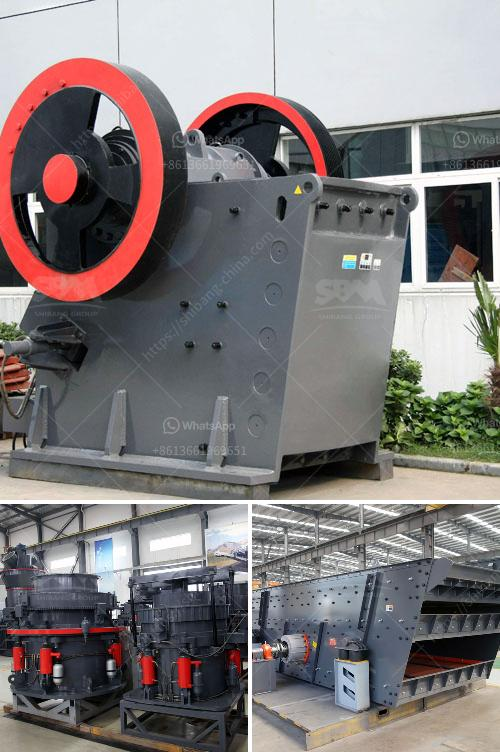

<h3>small scale stone crusher machine in kenya</h3>
Stone crusher machines are widely used in the mining industry, construction industry and other sectors to crush all kinds of stones and rocks, regardless of hardness. Typically, these machines are used in quarries, road construction, construction sites, and factories. In Kenya, stone crusher machines are popular for their high degree of automation, versatility, and environmentally friendly nature. So, what are the factors that make these machines popular in Kenya?

Firstly, stone crusher machines have a compact structure that is easy to use and maintain. The machine ensures that the stones are processed into the required size, which can be easily mixed with other building materials. This is important because many construction projects require a specific particle size to ensure that the structure is strong and long-lasting.

Secondly, stone crusher machines are used to break down and reduce the size of a wide range of materials. These materials include rock, limestone, concrete, and asphalt. They are also used for recycling construction waste, which is an environmentally friendly way to dispose of construction debris. These machines are powerful and can crush large quantities of materials in a short period of time, thus greatly saving labor and time.

Thirdly, stone crusher machines are versatile and can be used for both primary and secondary crushing. They are used to break down quarried rocks into smaller, more manageable sizes for further processing such as making cement, road base, asphalt chips, and building materials.

Fourthly, stone crusher machines are flexible and can be customised to meet specific requirements. For instance, the machines can be made to be mobile so that they can be moved to different worksites easily. This is especially beneficial for construction projects in remote areas where transportation of materials is challenging. Additionally, the machines can also be equipped with various attachments to increase functionality, such as screens to separate different sizes of crushed stones.

Lastly, stone crusher machines are affordable and readily available in the market. Small-scale stone crushing operations are an essential part in Kenya’s economic development, as they provide well-paying jobs for the local population. In areas where the demand for crushed stones is high, these workers earn a significant income by selling stones. Crushed stones are an important input in construction and infrastructure projects, and the demand for these materials is constantly growing.

In conclusion, stone crusher machines have proven to be a simple and cost-effective way to break down stones into smaller pieces, making them ideal for various construction projects in Kenya. In addition, the machines are environmentally friendly because they are electrically powered. Therefore, investing in stone crusher machines in Kenya will provide the most significant return for your investment.
<h3>Contact us</h3><ul><li><strong>Whatsapp:&nbsp;<a href="https://wa.me/8613661969651">+8613661969651</a></strong></li><li><a href="https://swt.shibang-china.com/?git&amp;zhl&amp;small scale stone crusher machine in kenya"><strong>Online Service(chat now)</strong></a></li></ul><h3>Related</h3><ul><li><a href='gemstone washing machine in china.md'>gemstone washing machine in china</a></li><li><a href='philippines crushing machine manufacturer in pakistan.md'>philippines crushing machine manufacturer in pakistan</a></li><li><a href='used stone crushing plant for sale in germany.md'>used stone crushing plant for sale in germany</a></li><li><a href='price of ball mill for sale.md'>price of ball mill for sale</a></li><li><a href='impact crusher zenith.md'>impact crusher zenith</a></li></ul>