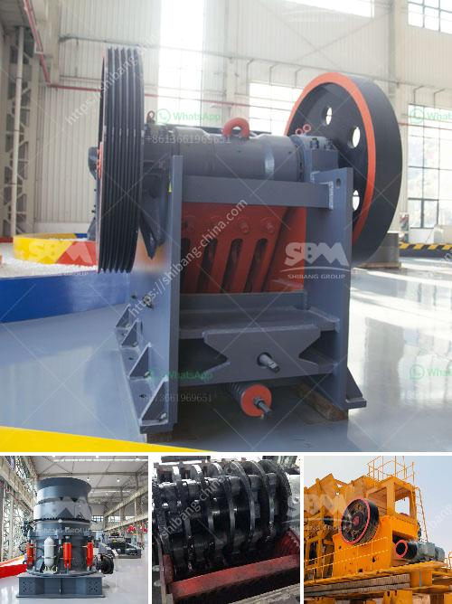

<h3>south africa coal mining cost per ton</h3>
South Africa is one of the leading coal-producing countries in the world. In fact, it ranks seventh globally in terms of coal production. The abundant coal reserves in South Africa have made it a staple in the country's energy mix. However, as with any natural resource, there are costs associated with its extraction and production. In this article, we will delve into the current coal mining costs per ton in South Africa.

The cost of mining coal in South Africa depends on various factors, such as the geology of the coal deposit, the presence of impurities, market demand, labor costs, and infrastructure investments. These factors can vary from mine to mine, resulting in different cost structures across the industry.

One of the major costs associated with coal mining is labor. South Africa has a long history of mining, and the industry has developed skilled labor forces over the years. However, labor costs have been increasing steadily, putting pressure on profit margins. In recent years, wage disputes and strikes in the mining sector have further exacerbated the labor cost issue.

Another factor contributing to the cost of mining coal in South Africa is the infrastructure required for transportation. Coal mines are often located in remote areas, far from major cities and ports. As a result, infrastructure investments are needed to transport the coal to market. This includes building railway lines, constructing coal terminals at ports, and maintaining road networks. These infrastructure costs significantly impact the overall cost per ton of coal.

Furthermore, the quality of coal can affect its market price and mining costs. South Africa produces both low-quality and high-quality coal. The low-quality coal has a higher ash content and lower calorific value, making it less desirable in the market. Extracting and processing low-quality coal can be more costly due to the need for additional washing and processing to meet market specifications.

Electricity and water costs also contribute to the overall cost per ton of coal. Mining operations require a significant amount of electricity to power machinery and lighting systems. Additionally, large quantities of water are needed for coal processing and dust suppression. Rising electricity and water costs in South Africa can add to the expenses faced by coal mining companies.

It is important to note that the cost per ton of coal can vary between open-pit and underground mines. While open-pit mining is generally more cost-effective, underground mining comes with its own set of challenges and costs. Underground mines require more extensive infrastructure, such as ventilation systems and shafts, which can drive up the cost per ton.

In conclusion, the cost of mining coal in South Africa depends on various factors, including labor, infrastructure, coal quality, and operational expenses. As the industry evolves, the cost per ton may fluctuate due to changes in market demand, regulations, and input costs. However, one thing remains clear: coal will continue to play a significant role in South Africa's energy mix, and understanding the cost dynamics of coal mining is vital for the industry's sustainability and profitability.
<h3>Contact us</h3><ul><li><strong>Whatsapp:&nbsp;<a href="https://wa.me/8613661969651">+8613661969651</a></strong></li><li><a href="https://swt.shibang-china.com/?git&amp;zhl&amp;south africa coal mining cost per ton"><strong>Online Service(chat now)</strong></a></li></ul><h3>Related</h3><ul><li><a href='list of equipment used gold diamond mining.md'>list of equipment used gold diamond mining</a></li><li><a href='iron ore beneficiation flowsheet.md'>iron ore beneficiation flowsheet</a></li><li><a href='proposal on quarry business.md'>proposal on quarry business</a></li><li><a href='sand washing plant suppliers.md'>sand washing plant suppliers</a></li><li><a href='limestone powder making machine.md'>limestone powder making machine</a></li></ul>