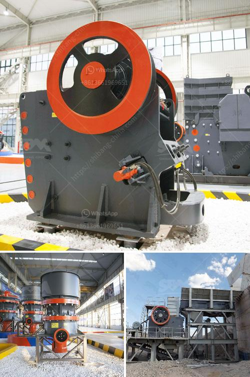

<h3>south africa second hand mobile stone crusher</h3>
South Africa is known for its excellent stone resources – the country is home to some of the world's biggest and most profitable mines. However, the free availability of these resources has resulted in a booming stone mining industry, with the extraction and crushing of stones accounting for a significant portion of the country's GDP. Stone crushing in South Africa is a crucial part of the mining industry, taking place in quarries across the country.

South Africa's vast stone reserves offer immense opportunities for the country's economy, but they also pose significant challenges for local communities and the environment. Mining activities often result in the displacement of local communities, biodiversity loss, and environmental degradation. Additionally, the stone mining industry can be highly capital-intensive, with expensive machinery and equipment required for efficient stone crushing operations.

In recent years, the demand for second-hand mobile stone crushers has been on the rise. This is not surprising considering the high cost of new mining equipment and the ever-increasing need for mineral resources. South Africa is known for its wealth of mineral resources, with over 90% of the world's platinum reserves and significant deposits of gold, diamonds, and other precious minerals.

Second-hand mobile crushers are not only an attractive alternative to new equipment but also a viable option for existing mining operators who may find it more cost-effective to refurbish their old machinery. These crushers offer the same capabilities as new models but at a fraction of the price. They are also readily available, making them an ideal choice for mining operations that need to ramp up production quickly.

The use of second-hand mobile stone crushers in South Africa is not only smart, but also environmentally friendly. The optimized use of resources can contribute to the sustainable development of mining operations. In addition, crushing stones on-site eliminates the need for transportation to and from quarries, saving energy and reducing carbon emissions.

There are several reputable suppliers of second-hand mobile crushers in South Africa that can provide high-quality equipment at competitive prices. These suppliers have a wide range of models available, suitable for various mining applications. From jaw crushers to cone crushers, screens, and impact crushers, they offer the versatility and performance required to meet the demands of the industry.

When considering the purchase of a second-hand mobile stone crusher, it is essential to conduct thorough research and due diligence. This includes evaluating the condition of the equipment, its service history, and the reputation of the supplier. It is also advisable to inspect the crusher in person or request a detailed video inspection to ensure that it meets your specific requirements.

In conclusion, the use of second-hand mobile stone crushers in South Africa offers mining operators a cost-effective and environmentally friendly solution. As the country's stone mining industry continues to grow, so does the demand for these crushers. With their availability and competitive pricing, they are an excellent option for any mining operation looking to enhance its productivity and sustainability.
<h3>Contact us</h3><ul><li><strong>Whatsapp:&nbsp;<a href="https://wa.me/8613661969651">+8613661969651</a></strong></li><li><a href="https://swt.shibang-china.com/?git&amp;zhl&amp;south africa second hand mobile stone crusher"><strong>Online Service(chat now)</strong></a></li></ul><h3>Related</h3><ul><li><a href='hammer mills for sale in zimbabwe.md'>hammer mills for sale in zimbabwe</a></li><li><a href='clay grinding machine.md'>clay grinding machine</a></li><li><a href='aggregate conveyor systems.md'>aggregate conveyor systems</a></li><li><a href='price list sag mill for sale.md'>price list sag mill for sale</a></li><li><a href='coal mill in china.md'>coal mill in china</a></li></ul>