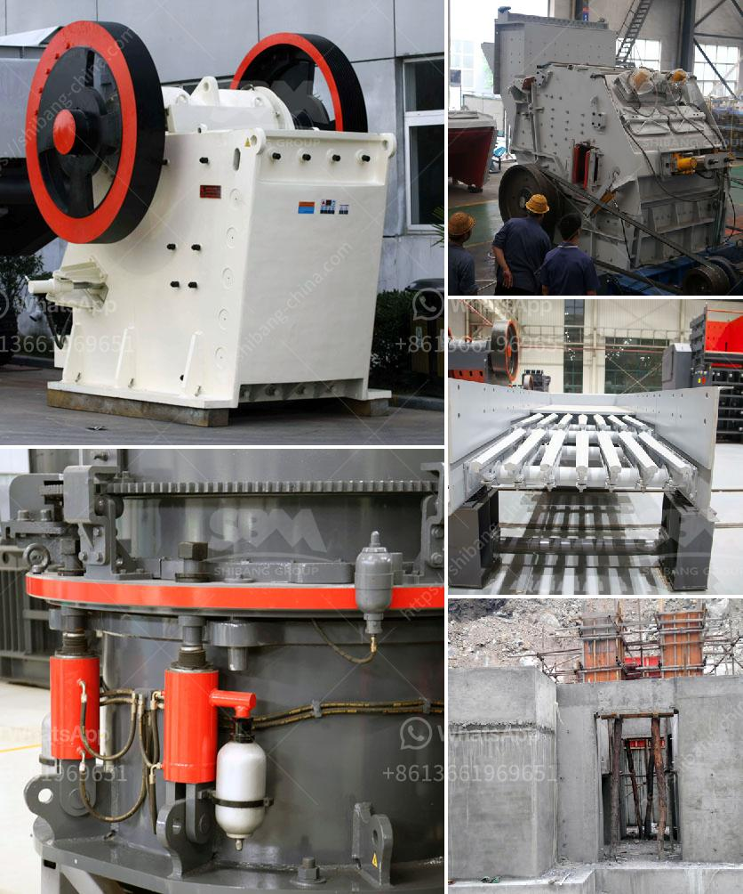

<h3>specifications of roller mill</h3>
A roller mill is a piece of heavy-duty machinery used to crush or grind objects like wheat or rocks. These machines function similar to a steamroller, as they flatten and crush material between two cylindrical rollers. This crushing process produces a fine, powdery substance, which can then be used for various applications. Roller mills are commonly used in industries like agriculture, mining, and construction due to their versatility and efficiency. In this article, we will explore the specifications of a roller mill.

Roller mills come in various sizes and capacities, depending on the specific application and desired output. Smaller roller mills may have a capacity of 200-300 pounds per hour, while larger roller mills can process up to several tons per hour. It is essential to choose the appropriate roller mill size to ensure optimal production efficiency.

The diameter and length of the rollers are critical specifications that determine the crushing capacity and fineness of the final product. Roller mills typically have two rollers, although some models may have more. The diameter of these rollers can range from a few inches to several feet, depending on the size of the roller mill. The longer the rollers, the larger the surface area available for crushing material, resulting in a finer grind.

Rollers are usually made of steel or cast iron, which ensures durability and longevity. Steel rollers generally have a higher hardness level and are suitable for crushing harder materials like rocks. Cast iron rollers, on the other hand, are ideal for grinding softer materials like grains. It is essential to select the appropriate roller material based on the nature of the material being processed.

The distance or gap between the rollers is adjustable in most roller mill models. This gap setting determines the fineness of the crushed material. A narrower gap will produce a finer grind, while a wider gap will result in a coarser product. The roller gap can be adjusted manually or automatically, depending on the mill's design and features.

Roller mills can be powered by electricity, diesel, or even steam engines. Electric-powered roller mills are the most common, as they are convenient and easy to operate. However, in remote areas or off-grid locations, diesel-powered or steam-powered roller mills may be utilized.

Roller mills require regular maintenance to ensure optimal performance and longevity. They usually have safety features like guards and emergency stop buttons to prevent accidents and injuries. It is crucial to follow the manufacturer's instructions for maintenance and safety to operate the roller mill safely and efficiently.

In conclusion, roller mills provide a versatile and efficient solution for crushing or grinding various materials. Their specifications, such as size, capacity, roller diameter and length, roller material and hardness, roller gap, power source, and maintenance features, play a crucial role in determining their performance and output. When choosing a roller mill, it is essential to consider these specifications based on the specific application and material requirements.
<h3>Contact us</h3><ul><li><strong>Whatsapp:&nbsp;<a href="https://wa.me/8613661969651">+8613661969651</a></strong></li><li><a href="https://swt.shibang-china.com/?git&amp;zhl&amp;specifications of roller mill"><strong>Online Service(chat now)</strong></a></li></ul><h3>Related</h3><ul><li><a href='gemstone mining in zambia.md'>gemstone mining in zambia</a></li><li><a href='simple stone crusher dubai.md'>simple stone crusher dubai</a></li><li><a href='price of gypsum plant.md'>price of gypsum plant</a></li><li><a href='japan used mine equipment price.md'>japan used mine equipment price</a></li><li><a href='second hand crushers and screens in south africa.md'>second hand crushers and screens in south africa</a></li></ul>