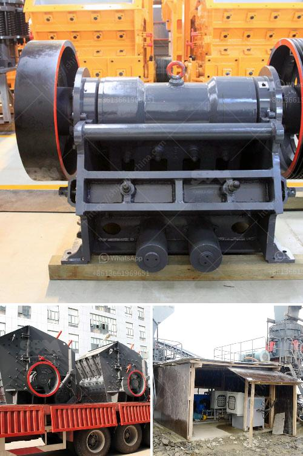

<h3>stamler usa feeder breaker crusher</h3>
The mining industry has constantly been a major contributor to the global economy. As crucial as mining operations are to the world, they are often considered to be dangerous and inefficient in terms of both environmental preservation and worker safety. Primarily focused on extracting valuable resources from the Earth, mining operations involve the tedious process of breaking and transporting enormous amounts of materials. With coal being the most widely used fuel for electricity generation worldwide, its accessibility is key for uninterrupted power supply.

One critical area that often suffers from inefficiency in mining operations is the handling and transportation of coal. Traditional manual handling of coal is associated with several challenges, such as dust pollution, environmental degradation, and significant strain on human resources. To overcome these challenges, advanced machinery is required to revolutionize coal handling systems, ultimately improving productivity and safety.

One such groundbreaking solution is the Stamler USA Feeder Breaker Crusher. The machine is designed to function as a primary crusher, fully capable of breaking down incoming coal into sizeable chunks, reducing the risk of mills and plant downtime in the process. The Feeder Breaker Crusher operates efficiently and safely, reducing the overall risk associated with coal handling and transportation.

The unique feature of the Stamler USA Feeder Breaker Crusher is its ability to generate minimal fines by rejecting undersize material, which significantly reduces the impact on the surrounding environment. This ensures that coal is accurately sized and reduces the risk of excessive dust generation during transportation. Additionally, the Feeder Breaker Crusher offers greater flexibility by allowing coal to be conveyed directly into a transport system or stockpiled for future use. This adaptability makes it an invaluable asset to mining companies aiming to streamline their coal handling processes.

The Stamler USA Feeder Breaker Crusher is known for its efficiency when compared to other typical crushing equipment. The adaptable nature of this machine allows for greater productivity and more significant savings on labor costs. Moreover, the Feeder Breaker Crusher minimizes the risk of injuries and accidents, significantly improving worker safety. The machine's robust construction eliminates the need for frequent maintenance, further reducing downtime and enhancing overall operational efficiency.

It is important to note that modern coal handling systems, such as the Stamler USA Feeder Breaker Crusher, are not only beneficial for mining companies but also for the environment. With a growing concern for air pollution and the adverse effects of coal mining on natural resources, the need for efficient coal handling has never been more critical. By implementing advanced machinery like the Feeder Breaker Crusher, companies can substantially reduce their carbon footprint, promoting a sustainable and greener future.

In conclusion, the Stamler USA Feeder Breaker Crusher is a reliable and effective machine capable of providing a sustainable solution to coal handling systems all over the world. The robust construction of this equipment ensures enhanced productivity and safety for mining operations. As the demand for coal-fired electricity generation remains high, it is imperative to adopt advanced technology like the Feeder Breaker Crusher to optimize coal handling processes and minimize the burden on both the environment and human resources.
<h3>Contact us</h3><ul><li><strong>Whatsapp:&nbsp;<a href="https://wa.me/8613661969651">+8613661969651</a></strong></li><li><a href="https://swt.shibang-china.com/?git&amp;zhl&amp;stamler usa feeder breaker crusher"><strong>Online Service(chat now)</strong></a></li></ul><h3>Related</h3><ul><li><a href='plant project report pdf stone crushing.md'>plant project report pdf stone crushing</a></li><li><a href='broach grinding machine manufacture in china.md'>broach grinding machine manufacture in china</a></li><li><a href='used mobile crusher in uae.md'>used mobile crusher in uae</a></li><li><a href='slag crusher manufacturer.md'>slag crusher manufacturer</a></li><li><a href='stone crushing machinery.md'>stone crushing machinery</a></li></ul>