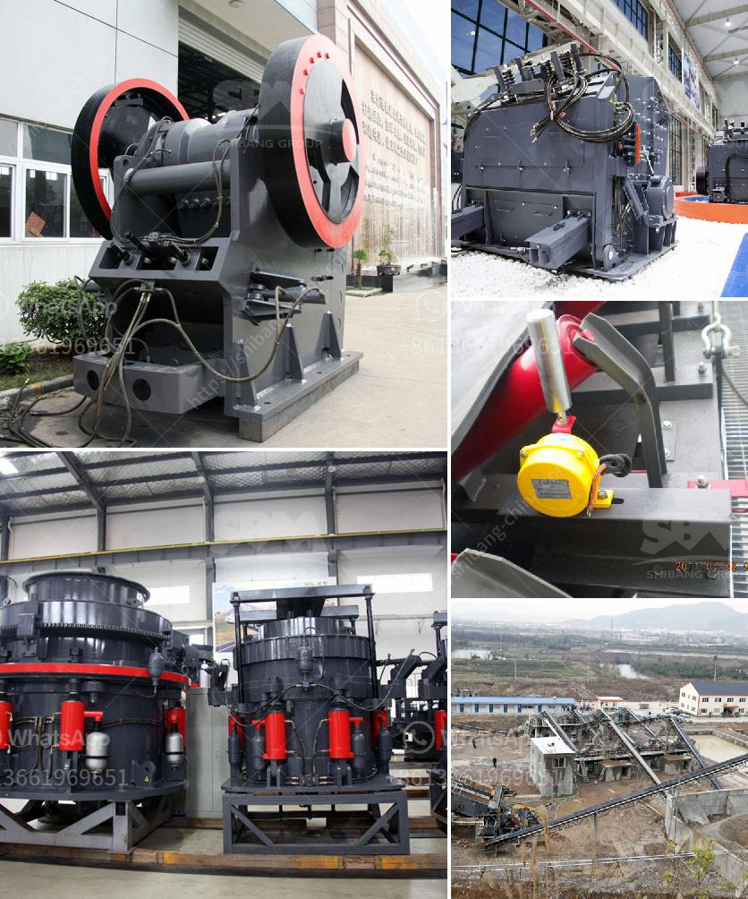

<h3>standard operating procedure of vibrating feeder</h3>
Vibrating feeder, also known as vibratory feeder or vibration feeder, is used to feed material into a conveyor belt, bucket elevator, screen, or crusher. It can be used in the processing industries for various applications such as feeding, dosing, batching, and mixing. In a typical configuration, the vibrating feeder operates underneath a hopper or bin and can transfer the material to a belt conveyor or other downstream equipment in a controlled manner.

The standard operating procedure of a vibrating feeder includes a few basic steps. First, the feeder is inspected for any damage or foreign objects that may have been deposited inside. During the inspection, the feeder support structure, springs, and any visible wear or damage are inspected. If any damage is found, it should be promptly repaired to avoid further issues.

Next, the feeder speed and amplitude are set according to the specific requirements of the application. The speed determines the flow rate of the material, while the amplitude controls the intensity of the vibrations. Both these parameters are essential to ensure a consistent and efficient feeding process. Adjusting the speed and amplitude can be done through a control panel or control system specifically designed for the vibrating feeder.

Once the parameters are set, the feeder is turned on and allowed to run at the desired speed and amplitude. The operator should monitor the feeder for any abnormalities such as excessive vibrations, unusual noises, or material blockages. In case of any issues, the feeder should be immediately stopped and inspected to identify the cause and take appropriate measures to resolve it.

Regular maintenance of the vibrating feeder is crucial to ensure its long-term reliability and performance. This includes periodic inspection and cleaning of the feeder components, lubrication of moving parts, and replacement of worn-out parts. Additionally, the electrical connections, sensors, and control systems should be checked regularly to ensure proper functioning.

Safety considerations are also an integral part of the standard operating procedure of a vibrating feeder. The operator should ensure that all personnel working in the vicinity of the feeder are aware of its operation and potential hazards. Personal protective equipment such as gloves, safety glasses, and hearing protection should be used when necessary. The feeder should be securely mounted to prevent any accidental movement or tipping over during operation.

In conclusion, the standard operating procedure of a vibrating feeder involves a thorough inspection, proper parameter setting, regular maintenance, and adherence to safety guidelines. Following these procedures ensures an efficient and safe operation of the vibrating feeder, reducing downtime, and prolonging its lifespan. By implementing these steps, businesses can maximize productivity, minimize maintenance costs, and improve overall process efficiency.
<h3>Contact us</h3><ul><li><strong>Whatsapp:&nbsp;<a href="https://wa.me/8613661969651">+8613661969651</a></strong></li><li><a href="https://swt.shibang-china.com/?git&amp;zhl&amp;standard operating procedure of vibrating feeder"><strong>Online Service(chat now)</strong></a></li></ul><h3>Related</h3><ul><li><a href='cone crusher plant for sale.md'>cone crusher plant for sale</a></li><li><a href='china best crusher manufacturers.md'>china best crusher manufacturers</a></li><li><a href='mobile crusher hire kenya.md'>mobile crusher hire kenya</a></li><li><a href='industrial ball mill for sale.md'>industrial ball mill for sale</a></li><li><a href='iron ore beneficiation flowsheet.md'>iron ore beneficiation flowsheet</a></li></ul>