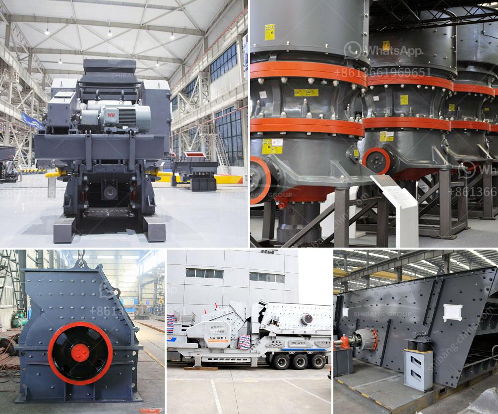

<h3>standard specification sheet for ball mill</h3>
A ball mill is a type of grinder used to grind materials into extremely fine powder for use in mineral dressing processes, paints, pyrotechnics, ceramics, and selective laser sintering. The standard specification sheet for a ball mill consists of the following:

The following information regarding the ball mill's specifications is described in the following ways:

Length: The length of the ball mill is determined by the amount of material required to be ground, and it must have a certain margin during the operation. The length of the mill can be customized according to a customer's request.

Mill Type: The ball mill can be divided into overflow type and grid type according to the ore discharge method. The overflow type is suitable for the grinding of more dense and viscous materials while the grid type is commonly used for lighter and coarse materials.

Capacity: The capacity is the maximum amount of material that can be processed by the ball mill in a certain period of time. It is determined by the size, shape, and density of the grinding media as well as the rotational speed of the mill.

Motor Power: The motor power is responsible for driving the ball mill to rotate, which is essential for the grinding process. It is usually specified in kilowatts (kW) or horsepower (HP) and is determined by the size and characteristics of the mill.

Mill Speed: The mill speed refers to the rotational speed of the ball mill cylinder, which affects the grinding efficiency. Generally, the higher the mill speed, the faster the grinding process, but too high speed may result in inefficient grinding and increased energy consumption.

Lining Plate Material: The lining plate material is chosen based on the requirements of the grinding process. It can be made of various materials such as high chromium cast iron, rubber, ceramic, or manganese steel.

Overall, the standard specification sheet provides crucial information about the ball mill's design, capacity, power, speed, and materials used. This information aids engineers and manufacturers in designing and constructing efficient and reliable ball mills for various industrial applications.
<h3>Contact us</h3><ul><li><strong>Whatsapp:&nbsp;<a href="https://wa.me/8613661969651">+8613661969651</a></strong></li><li><a href="https://swt.shibang-china.com/?git&amp;zhl&amp;standard specification sheet for ball mill"><strong>Online Service(chat now)</strong></a></li></ul><h3>Related</h3><ul><li><a href='raymond used mill for sale.md'>raymond used mill for sale</a></li><li><a href='ultra grinder service center mumbai.md'>ultra grinder service center mumbai</a></li><li><a href='used stone crushers in pakistan.md'>used stone crushers in pakistan</a></li><li><a href='fly ash processing plant machinery.md'>fly ash processing plant machinery</a></li><li><a href='crushing service with peru jaw crusher.md'>crushing service with peru jaw crusher</a></li></ul>