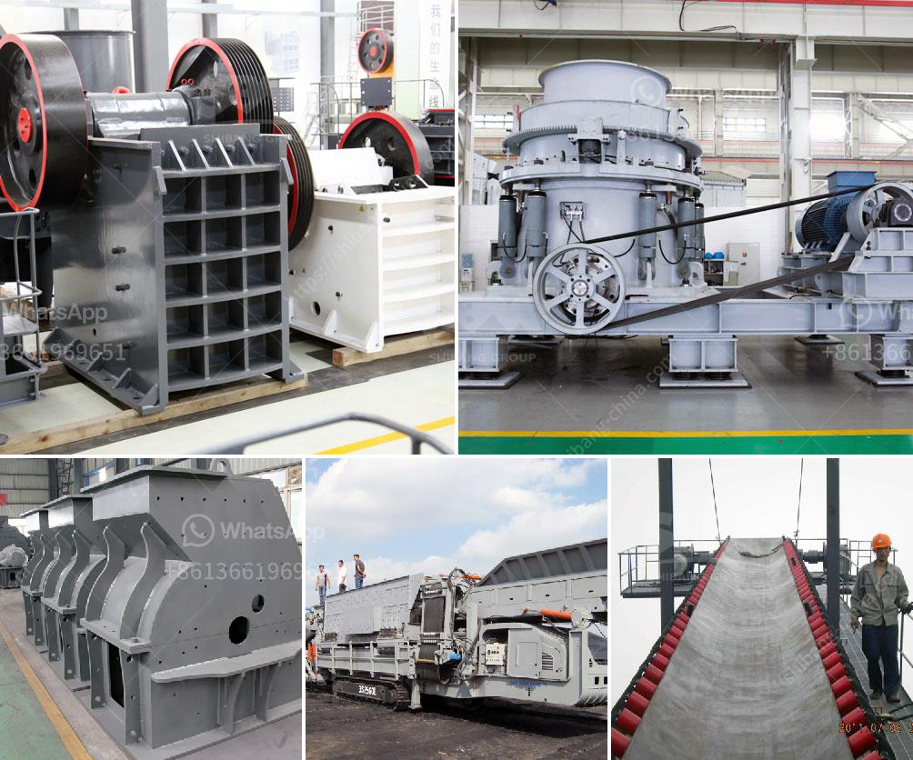

<h3>start up procedure for ball mill</h3>
Ball mill is an essential equipment in mineral processing plants. It is usually used in grinding operations, such as cement, silicate products, new building materials, refractory material, chemical fertilizer, glass ceramics, etc. In order to ensure the stable operation of the ball mill and improve its performance, it is necessary to carry out routine maintenance and regular repairs.

- Whether the lubrication system of the mill, including a lubricating pump, oil level gauge, and oil circuit is functioning properly.

- Whether the protection devices, such as safety interlocks and emergency stops, are working correctly.

After checking the above items, it is essential to inspect and lubricate the ball mill. Adequate lubrication helps in reducing friction and wear, extending the equipment's life. Before operating the ball mill, ensure that all lubrication points are adequately greased with a lubricating oil or a grease.

To start the ball mill, you should first start the lubricating oil pump and cooling water system, and ensure the pressure, temperature, and flow rate of each system are normal. Then, start the motor of the ball mill. Once the motor starts running, slowly move the ball mill's control valve, allowing the slurry to fill in the mill evenly. Gradually increase the slurry flow rate until the required flow is achieved.

Once the ball mill starts operating, it is crucial to continuously monitor its working conditions. Check the motor ampere reading, the temperature of the inlet and outlet of the ball mill, and other relevant parameters regularly. If any abnormality is found, such as low flow rate or high temperature, immediate actions should be taken to troubleshoot and rectify the issue.

After completing the grinding process, it is necessary to follow a proper shut down procedure. First, stop the slurry feeding pump and the ball mill's motor. Then, stop the lubricating pump and cooling water system. Finally, close the intake valve and open the slurry drain valve to empty the mill. It is recommended to clean the ball mill and its accessories before the next use.

In conclusion, starting up a ball mill requires careful inspection, proper lubrication, and monitoring. By following the step-by-step procedure mentioned above, the ball mill can be started smoothly and operate efficiently. Regular maintenance and repairs are also critical in ensuring the ball mill's optimal performance in the long run.
<h3>Contact us</h3><ul><li><strong>Whatsapp:&nbsp;<a href="https://wa.me/8613661969651">+8613661969651</a></strong></li><li><a href="https://swt.shibang-china.com/?git&amp;zhl&amp;start up procedure for ball mill"><strong>Online Service(chat now)</strong></a></li></ul><h3>Related</h3><ul><li><a href='small conveyor belt to move coal for home use.md'>small conveyor belt to move coal for home use</a></li><li><a href='brick machine manufacturers south africa.md'>brick machine manufacturers south africa</a></li><li><a href='ball mill hou feng in china.md'>ball mill hou feng in china</a></li><li><a href='vertical impact crusher quote.md'>vertical impact crusher quote</a></li><li><a href='recycled glass price per tonne in durban.md'>recycled glass price per tonne in durban</a></li></ul>