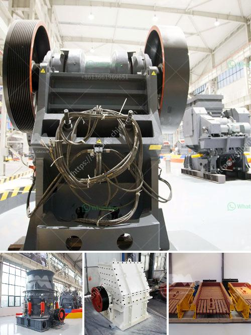

<h3>starting a quarry business in nigeria</h3>
The Nigerian quarry business sector is expanding at a rapid rate. Many construction companies are seeking reliable quarrying firms to supply them with various construction materials. High-quality limestone, granite, and other stone materials are abundant in Nigeria, making quarry businesses a lucrative venture.

Starting a quarry business in Nigeria requires minimal capital and can be done on a small to medium scale. Unlike other types of businesses that require huge startup capital, a quarry business can be operated with just a few employees. The key to success in this business is efficiency and productivity.

Firstly, you need to secure a suitable location for your quarry. Proper geological research should be conducted to ensure that the site has sufficient reserves of the desired stone materials. Additionally, it should be conveniently located to major construction companies and accessible transportation routes.

Next, you need to obtain the necessary permits and licenses from the relevant government agencies. This includes registering the business with the Corporate Affairs Commission and obtaining the required quarrying and mining licenses from regulatory authorities such as the Ministry of Mines and Steel Development.

Once all legal requirements are met, you can begin acquiring the necessary equipment needed for the quarry operations. This may include excavators, loaders, crushing machines, and trucks for transporting the materials.

Marketing and building relationships with construction companies is crucial for the success of your quarry business. Attend industry trade shows, join construction associations, and advertise your services to attract potential clients. Building a solid reputation for supplying quality materials and meeting delivery deadlines will help you secure long-term contracts.

In conclusion, starting a quarry business in Nigeria can be a profitable and rewarding undertaking. With the right location, permits, and equipment, as well as effective marketing strategies, your quarry business can thrive in Nigeria's growing construction industry.
<h3>Contact us</h3><ul><li><strong>Whatsapp:&nbsp;<a href="https://wa.me/8613661969651">+8613661969651</a></strong></li><li><a href="https://swt.shibang-china.com/?git&amp;zhl&amp;starting a quarry business in nigeria"><strong>Online Service(chat now)</strong></a></li></ul><h3>Related</h3><ul><li><a href='jaw crushing machine.md'>jaw crushing machine</a></li><li><a href='used coal washing plants for sale in pakistan.md'>used coal washing plants for sale in pakistan</a></li><li><a href='stone quarry crusher equipment germany.md'>stone quarry crusher equipment germany</a></li><li><a href='stone crusher machine price in kenya.md'>stone crusher machine price in kenya</a></li><li><a href='kenya mobile crusher philippines.md'>kenya mobile crusher philippines</a></li></ul>