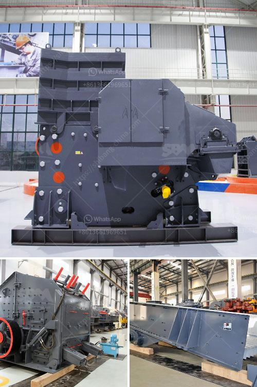

<h3>station de concassage daun une carriere</h3>
La station de concassage est un équipement essentiel dans le domaine des carrières, utilisé pour transformer les gros blocs de pierre en matériaux de construction. La station de concassage Daun est l'un des exemples les plus efficaces et modernes de cette technologie.

Située dans une carrière bien connue, la station de concassage Daun offre une variété d'avantages qui la distinguent des autres. Tout d'abord, elle dispose d'une capacité de production élevée, capable de traiter de grandes quantités de matériaux en peu de temps. Cela permet non seulement d'augmenter l'efficacité de la carrière, mais aussi de répondre à la demande croissante de matériaux de construction sur le marché.

Un autre avantage de la station de concassage Daun est sa polyvalence. Elle est capable de traiter différents types de matériaux tels que la pierre calcaire, la roche volcanique et même certains matériaux recyclés. Cela permet à la carrière de diversifier sa production et de répondre aux besoins spécifiques des clients.

La station de concassage Daun se distingue également par sa facilité d'utilisation. Elle est équipée d'un panneau de contrôle convivial qui permet aux opérateurs de contrôler facilement la machine. De plus, elle est conçue de manière ergonomique pour faciliter l'accès et la maintenance. Cela réduit les temps d'arrêt et garantit une production régulière.

En termes de performances, la station de concassage Daun offre des résultats exceptionnels. Elle est équipée de concasseurs puissants qui garantissent une réduction maximale des matériaux en blocs de taille plus petite. De plus, grâce à son système de criblage avancé, elle est capable de séparer efficacement les différents granulats. Cela permet d'obtenir des matériaux de haute qualité, conformes aux normes de construction.

Outre sa performance, la station de concassage Daun se soucie également de l'environnement. Elle est équipée d'un système de dépoussiérage qui minimise au maximum les émissions de poussière. De plus, elle est dotée d'une fonction de recyclage de l'eau qui permet de réduire la consommation et de préserver les ressources naturelles.

En conclusion, la station de concassage Daun est une solution moderne et efficace pour les carrières. Grâce à sa capacité de production élevée, sa polyvalence, sa facilité d'utilisation et ses performances exceptionnelles, elle offre de nombreux avantages à ses utilisateurs. De plus, sa préoccupation pour l'environnement en fait un choix responsable. La station de concassage Daun est donc un investissement judicieux pour toute carrière cherchant à améliorer sa production et à satisfaire les besoins du marché de la construction.
<h3>Contact us</h3><ul><li><strong>Whatsapp:&nbsp;<a href="https://wa.me/8613661969651">+8613661969651</a></strong></li><li><a href="https://swt.shibang-china.com/?git&amp;zhl&amp;station de concassage daun une carriere"><strong>Online Service(chat now)</strong></a></li></ul><h3>Related</h3><ul><li><a href='crushing machine manufacturer in pakistan price.md'>crushing machine manufacturer in pakistan price</a></li><li><a href='ball mill for sale uk.md'>ball mill for sale uk</a></li><li><a href='mobile stone crushing.md'>mobile stone crushing</a></li><li><a href='large volume conveyor belt systems rentals.md'>large volume conveyor belt systems rentals</a></li><li><a href='stone crusher design philippines.md'>stone crusher design philippines</a></li></ul>