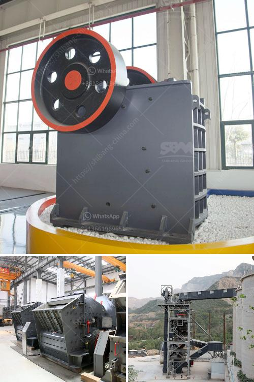

<h3>stationary jaw crusher</h3>
The stationary jaw crusher, also known as a fixed jaw crusher, is indispensable for any crushing project. It plays an important role in the initial stage of crushing, ensuring that oversized materials are broken down to size and efficiently processed for further refinement.

The stationary jaw crusher is designed for the hardest stones and ores, ensuring outstanding performance and high productivity while maintaining low operating costs. Built for durability and reliability, it is often utilized in aggregates production, quarrying applications, and mining operations.

One of the main advantages of the stationary jaw crusher is its reliability. Since the crushing chamber is permanently fixed, the likelihood of sudden equipment failure is significantly reduced. This means less downtime and increased productivity, allowing operators to focus on other essential tasks.

Furthermore, the stationary jaw crusher is known for its robust construction, enabling it to withstand the toughest working conditions. It is built with heavy-duty steel plates and reinforced frames, designed to withstand excessive force exerted by rocks, minerals, and other hard materials.

Another key feature of the stationary jaw crusher is its high efficiency. The specially designed deep crushing chamber ensures that the material is fully processed, allowing for optimum reduction ratios. This results in a high-quality final product with a uniform particle size distribution, meeting the specific requirements of various applications.

In addition, the stationary jaw crusher is designed with easy maintenance in mind. The access doors on the side of the machine make it easy to inspect and clean the crushing chamber, ensuring optimal performance and prolonging the service life of the equipment.

To enhance safety, many stationary jaw crushers are equipped with a hydraulic toggle system. This system enables quick and safe adjustments to the closed side setting, preventing any potential accidents or damages to the crusher.

Moreover, the stationary jaw crusher offers versatility in terms of customization. It can be equipped with various optional features, such as integrated motor mountings, automatic lubrication systems, and hydraulic adjustment systems, to meet specific requirements and enhance operational efficiency.

In conclusion, the stationary jaw crusher is a reliable, robust, and efficient crushing solution that provides outstanding performance in various applications. Its durability, high productivity, and low operating costs make it the ideal choice for reducing oversized materials and achieving desired particle sizes. Whether for aggregates production, quarrying, or mining operations, the stationary jaw crusher is a reliable and essential equipment that delivers superior results.
<h3>Contact us</h3><ul><li><strong>Whatsapp:&nbsp;<a href="https://wa.me/8613661969651">+8613661969651</a></strong></li><li><a href="https://swt.shibang-china.com/?git&amp;zhl&amp;stationary jaw crusher"><strong>Online Service(chat now)</strong></a></li></ul><h3>Related</h3><ul><li><a href='iron crushing equipment.md'>iron crushing equipment</a></li><li><a href='stone crushing machineries imphal.md'>stone crushing machineries imphal</a></li><li><a href='blast furnace slag grinding machine india.md'>blast furnace slag grinding machine india</a></li><li><a href='stone rock crushers in oman for sale.md'>stone rock crushers in oman for sale</a></li><li><a href='business plan for sand making machine.md'>business plan for sand making machine</a></li></ul>