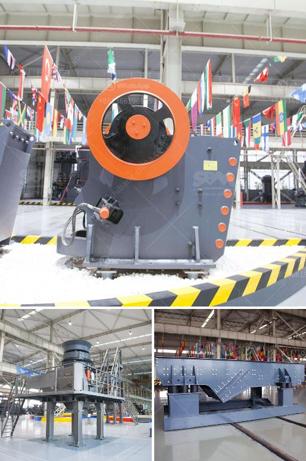

<h3>stone aggregate crusher</h3>
Stone aggregate crusher is the machine created to crush large stones into smaller rocks and gravel. This equipment is widely used in building sites, highways, railways, and other construction projects to break down the larger rocks into smaller, more manageable sizes. The primary purpose of stone aggregate crushers is to reduce the size of stones so they can be used for various construction purposes.

Stone aggregate crushers come in different models and sizes. They are designed to handle a wide range of materials, including the hardest rocks, such as granite, and various ores, such as iron ore, copper, and gold. The crushing process involves applying a force that breaks down the material into smaller pieces. This allows for easier handling, transportation, and storage of the crushed stone.

There are several types of stone aggregate crushers available in the market. Jaw crushers are commonly used for primary crushing, where the stones are initially crushed to a smaller size. Cone crushers are used to further reduce the size of the stones into even finer particles. Impact crushers are also commonly used in stone aggregate crushing. They can be used to crush various types of rocks, including limestone and basalt.

Stone aggregate crushers are highly efficient machines that are designed to produce uniform-sized aggregate. They are widely used in the construction industry for various purposes, such as producing concrete, asphalt, and railway ballast. The crushed stones from these crushers are used in the production of building materials, such as cement, concrete blocks, and bricks.

Apart from their use in construction, stone aggregate crushers also have a significant environmental impact. The crushing process generates a considerable amount of dust, which can be harmful to human health and the environment. Various measures are taken to control and minimize the dust emissions from these crushers, such as using water sprays and dust suppression systems.

Stone aggregate crushers are typically powered by electricity or diesel engines. They are designed to be highly durable and reliable, with minimal maintenance requirements. Regular servicing and maintenance ensure that these machines continue to operate efficiently and effectively.

In conclusion, stone aggregate crushers play a crucial role in the construction industry. They are designed to break down larger rocks into smaller, more manageable sizes, making them suitable for various construction purposes. These crushers are efficient, reliable, and durable. However, they also have environmental implications due to the dust generated during the crushing process. Overall, stone aggregate crushers are essential machines in the modern construction industry.
<h3>Contact us</h3><ul><li><strong>Whatsapp:&nbsp;<a href="https://wa.me/8613661969651">+8613661969651</a></strong></li><li><a href="https://swt.shibang-china.com/?git&amp;zhl&amp;stone aggregate crusher"><strong>Online Service(chat now)</strong></a></li></ul><h3>Related</h3><ul><li><a href='screens hammer mills.md'>screens hammer mills</a></li><li><a href='jaw plate for jaw crusher breaker.md'>jaw plate for jaw crusher breaker</a></li><li><a href='stone crusher machine south africa.md'>stone crusher machine south africa</a></li><li><a href='3 4 inch crushed limestone.md'>3 4 inch crushed limestone</a></li><li><a href='stone quarrys crusher in ghana.md'>stone quarrys crusher in ghana</a></li></ul>