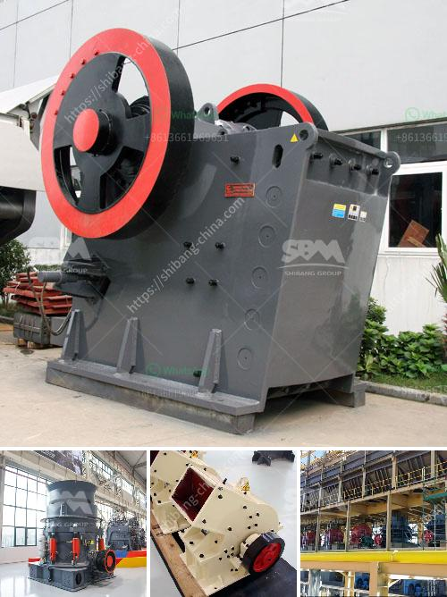

<h3>stone aggregate screen in south africa</h3>
Stone Aggregate Screen in South Africa: Enhancing Efficiency and Productivity in Construction Industry

South Africa has a thriving construction industry which requires massive quantities of gravel, sand, and other materials for various construction projects. The demand for stone aggregate has led to the development of specialized screening machinery that efficiently sorts and separates stones of different sizes. These stone aggregate screens have played a crucial role in enhancing the efficiency and productivity of the construction industry in South Africa.

Stone aggregate screens, also known as vibrating screens or deck screens, are primarily used in the mining and quarrying industry. They separate the crushed stone based on size and help to produce a more uniform and quality stone aggregate. With the use of these screens, construction companies can conveniently obtain the required stone aggregates for their projects.

One of the main advantages of stone aggregate screens is their ability to handle large quantities of material quickly. They can efficiently screen thousands of tons of stone aggregate per hour, saving both time and labor. By automating the screening process, construction companies can significantly increase their productivity and meet tight project deadlines. This increased efficiency translates into cost savings and improved profitability for the industry.

Moreover, stone aggregate screens are equipped with advanced technologies that allow for adjustable settings. This flexibility enables construction companies to produce stone aggregates of different sizes and specifications according to the requirements of their specific projects. Whether it's fine sand or larger stones, these screens can be adjusted to deliver the desired output, contributing to the versatility and adaptability of the construction industry in South Africa.

Another crucial benefit of stone aggregate screens is their ability to reduce waste. The screening process separates the stone aggregates based on size, ensuring that only the required sizes are utilized in construction projects. This eliminates the need for additional processing or removal of oversize stones, streamlining the construction process and reducing overall material wastage. This sustainable approach not only minimizes environmental impact but also improves cost-effectiveness for construction companies.

The durability and reliability of stone aggregate screens are also noteworthy. Designed to withstand harsh working conditions, these screens are built with high-grade materials that can endure the demands of the mining and quarrying industry. This longevity minimizes downtime and maintenance costs, allowing construction companies to operate smoothly and consistently.

In conclusion, stone aggregate screens have revolutionized the construction industry in South Africa by enhancing efficiency, productivity, and sustainability. The ability to handle massive quantities of material quickly, their adjustable settings, and the reduction of waste have all contributed to meeting project deadlines, producing high-quality stone aggregates, and increasing profitability. As the demand for stone aggregates continues to grow, the use of specialized screening machinery like stone aggregate screens will remain an integral part of the construction industry in South Africa.
<h3>Contact us</h3><ul><li><strong>Whatsapp:&nbsp;<a href="https://wa.me/8613661969651">+8613661969651</a></strong></li><li><a href="https://swt.shibang-china.com/?git&amp;zhl&amp;stone aggregate screen in south africa"><strong>Online Service(chat now)</strong></a></li></ul><h3>Related</h3><ul><li><a href='clay powder machine.md'>clay powder machine</a></li><li><a href='rollers for conveyor belts manizales.md'>rollers for conveyor belts manizales</a></li><li><a href='stone quarry business proposal crusher machine.md'>stone quarry business proposal crusher machine</a></li><li><a href='precipitated calcium carbonate milling.md'>precipitated calcium carbonate milling</a></li><li><a href='impact crusher hammer mill.md'>impact crusher hammer mill</a></li></ul>