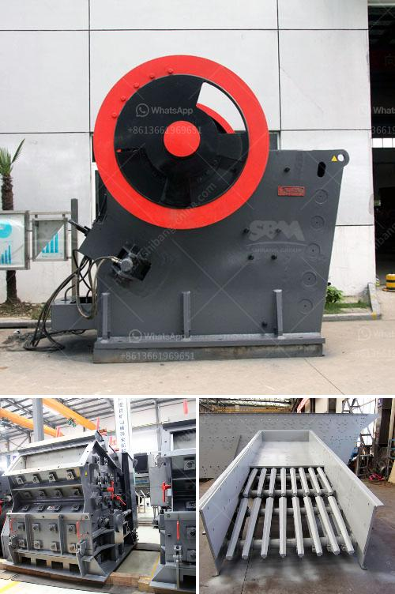

<h3>stone cape crusher for sale china</h3>
Crushers are a ubiquitous piece of equipment used in many industries. A stone crusher is a machine that reduces large rocks into smaller rocks, gravel, or rock dust. Crushers are able to break apart or compress soft materials such as limestone, gypsum and phosphate, to very hard materials such as ore and asphalt. There are many different types of crushers available in the market, ranging from jaw crushers to cone crushers, impact crushers, and roll crushers. However, the stone cape crusher is one of the most popular and widely used crushers in China.

The stone cape crusher is primarily used for crushing stone and clinker, as well as raw materials with compressive strength less than 250 Mpa and moisture content below 15%. It has the advantages of high crushing ratio, high production efficiency, and low energy consumption. It can break the stone into uniform particle size, which is suitable for further processing and utilization.

China, as one of the world's largest stone production countries, has a huge demand for stone crushers. In recent years, the Chinese government has increased investment in infrastructure construction and stimulated domestic demand for stone crushers. With the development of China's construction industry and the improvement of people's living standards, the demand for building materials such as gravel and sand is increasing, which has greatly promoted the development of the stone crusher industry.

As the leading stone crusher manufacturer and exporter in China, we will provide maximum preferential factory price and discount for you. Our stone crusher has been exported to South Africa, Kenya, Nigeria, Ethiopia, Zambia, Namibia, Somalia, Nepal, Pakistan, Philippines, Malaysia, Saudi Arabic and over 90 countries around the world. Our stone crusher machine can crush many materials, such as stones, ores, rocks, and so on.

The stone cape crusher is an ideal choice for contractors who want to move the crushers from one site to another periodically to reduce the transportation cost. It has large capacity and can crush various types of materials. The stone cape crusher is equipped with a high-power motor and a large crushing chamber, which enables the machine to have a high output and crushing ratio. Its hydraulic system adopts intelligent control, which not only saves labor costs, but also greatly improves the stability and performance of the equipment.

In addition to its excellent performance, the stone cape crusher for sale from China has been successfully used in different projects. For example, the stone crushers are used for crushing stones and hard rocks fed into it. They are highly efficient and can be easily transported. Hydraulic breakers are used for demolishing hard structures and can be easily attached to excavators for greater efficiency. Our stone cape crusher machine can be used in many applications and can be customized according to clients' specific requirements.

In conclusion, stone cape crusher is a perfect practical and reliable crushing and grinding tool in the stone quarry industry. For high-quality end products, stone cape crusher is available for sale from China, one of the world's leading manufacturers with over 30 years of experience in stone crushing machine manufacturing. With advancements in technology and an ever-increasing demand for construction materials, the stone cape crusher is set to continue its strong growth trajectory in China and the global market.
<h3>Contact us</h3><ul><li><strong>Whatsapp:&nbsp;<a href="https://wa.me/8613661969651">+8613661969651</a></strong></li><li><a href="https://swt.shibang-china.com/?git&amp;zhl&amp;stone cape crusher for sale china"><strong>Online Service(chat now)</strong></a></li></ul><h3>Related</h3><ul><li><a href='grinding mill for limestone italy in bergamo.md'>grinding mill for limestone italy in bergamo</a></li><li><a href='price of hammer mill in china.md'>price of hammer mill in china</a></li><li><a href='price rock crusher.md'>price rock crusher</a></li><li><a href='cement plant layout pdf.md'>cement plant layout pdf</a></li><li><a href='cone crushers manufacturer.md'>cone crushers manufacturer</a></li></ul>