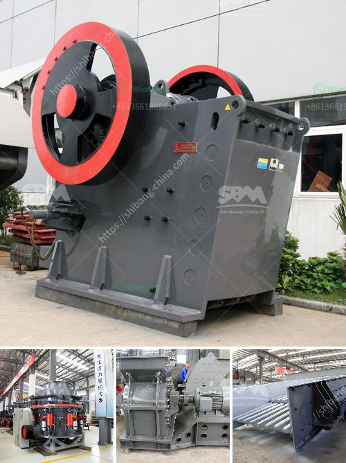

<h3>stone crusher coalaries</h3>
A stone crusher, also known as rock crusher, is an essential equipment in the mining and construction industry. Its applications are diverse, ranging from aggregate production, road construction, and recycling to mining and quarrying. It is usually comprised of a primary crushing unit and a secondary crusher, both of which work together to reduce the material size into usable aggregates for various purposes.

One aspect that should be noted about stone crushers is the significant number of personnel involved in its operation. These workers may include the machine operators, maintenance technicians, and support staff. Since the stone crusher process involves a high level of physical and mental strength, the salaries for these professionals are quite competitive.

The salary range for stone crusher professionals can vary significantly depending on various factors such as experience, qualifications, and location. On average, a stone crusher operator can earn around $27 per hour, while a maintenance technician may earn up to $30 per hour. These figures can differ based on the geographical location, with higher wages being offered in regions where mining and construction activities are more prominent.

In addition to the primary roles, there are other supporting positions such as supervisors, quality control professionals, and sales representatives. These individuals contribute to the overall success of the stone crusher operation and are compensated accordingly. Often, sales representatives who secure contracts for stone crusher services can earn commissions or bonuses to supplement their base salary.

The stone crusher industry offers various opportunities for career growth and advancements. Those starting as machine operators can gradually progress to become supervisors or even site managers. With the right experience and expertise, professionals can have the chance to manage large-scale operations and oversee a team of workers.

Although the nature of the stone crusher industry requires physical labor and can be physically demanding, it provides stable employment opportunities for those interested in working in this field. However, it is essential to highlight that these jobs often require individuals to work in challenging environments, such as quarries or construction sites. Therefore, it's crucial for workers to adhere to safety protocols and wear protective gear to minimize any potential hazards.

In conclusion, the stone crusher industry offers competitive salaries to its workforce. From machine operators and maintenance technicians to supervisors and sales representatives, there are various positions available in this field. The salaries can vary depending on factors like experience, qualifications, and location. Despite the physical demands, the stone crusher industry provides stable employment opportunities and opportunities for career growth for those interested in this sector.
<h3>Contact us</h3><ul><li><strong>Whatsapp:&nbsp;<a href="https://wa.me/8613661969651">+8613661969651</a></strong></li><li><a href="https://swt.shibang-china.com/?git&amp;zhl&amp;stone crusher coalaries"><strong>Online Service(chat now)</strong></a></li></ul><h3>Related</h3><ul><li><a href='second hand crushers and screens in south africa.md'>second hand crushers and screens in south africa</a></li><li><a href='costruire une machine pour broyer des briques.md'>costruire une machine pour broyer des briques</a></li><li><a href='sand making plant sand washing plant.md'>sand making plant sand washing plant</a></li><li><a href='mineral materials crusher.md'>mineral materials crusher</a></li><li><a href='roller mill in india.md'>roller mill in india</a></li></ul>