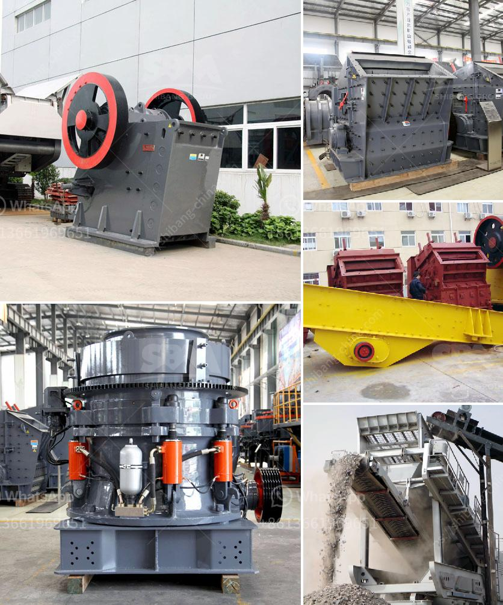

<h3>stone crusher cost</h3>
The increasing demand for stone materials in construction, infrastructure, and other similar industries has led to the need for cost-effective and efficient stone crushers. As the name suggests, a stone crusher is a machine used to crush various types of stones into different sizes for different purposes.

The cost of a stone crusher primarily depends on the type of stone crusher equipment chosen. This equipment plays a crucial role in the processing of stones, enabling companies to effectively and efficiently produce high-quality aggregates and stones for their projects. However, the cost of stone crusher equipment can vary greatly depending on the type and brand of the equipment, as well as the capacity and production requirements.

When considering the cost of a stone crusher, it is essential to consider factors such as the raw material and the desired output size. The raw material plays a significant role in determining the cost of the equipment since different materials have varying hardness and abrasiveness. Harder materials may require more robust and expensive equipment, while softer materials may be processed using less expensive machines. Additionally, the desired output size will determine the type of equipment needed, as crushers vary in their ability to produce different sizes of crushed stones.

Another crucial factor to consider when assessing the cost of a stone crusher is the initial investment required. Stone crushers are available in various sizes and capacities, requiring different levels of investment. Smaller capacity machines are usually more affordable upfront but may require additional investments in terms of maintenance and upgrading. It is essential to carefully evaluate the long-term costs of owning and operating different stone crusher equipment before making a purchase.

In addition to the initial investment, ongoing operational costs must also be considered. These costs include expenses such as fuel, power consumption, and maintenance. Fuel consumption is a significant expense for stone crushers, especially for those operating in remote areas or with limited access to fuel sources. Power consumption is another essential factor to consider as it directly impacts the operational costs of the equipment. It is crucial to choose a stone crusher that is energy-efficient to minimize ongoing operational expenses.

Maintenance is an unavoidable part of owning stone crusher equipment and should not be overlooked when calculating the overall cost. Regular maintenance ensures the equipment's longevity, reduces the risk of breakdowns, and improves overall productivity. It is important to factor in the cost of spare parts and servicing when evaluating the total cost of ownership.

Despite the various costs associated with stone crushers, they are considered an essential investment for companies involved in the construction and infrastructure industry. By choosing the right type of equipment and considering factors such as raw material, desired output size, initial investment, ongoing operational costs, and maintenance, companies can maximize their return on investment while efficiently meeting their stone crushing requirements.

In conclusion, the cost of a stone crusher depends on various factors, including the type of equipment chosen, the raw material, the desired output size, and the initial investment and ongoing operational costs. Choosing the right stone crusher equipment is crucial for cost-effective and efficient stone crushing operations, enabling companies to produce high-quality aggregates and stones for their projects.
<h3>Contact us</h3><ul><li><strong>Whatsapp:&nbsp;<a href="https://wa.me/8613661969651">+8613661969651</a></strong></li><li><a href="https://swt.shibang-china.com/?git&amp;zhl&amp;stone crusher cost"><strong>Online Service(chat now)</strong></a></li></ul><h3>Related</h3><ul><li><a href='iron ore crushers.md'>iron ore crushers</a></li><li><a href='aggregate production plant pdf.md'>aggregate production plant pdf</a></li><li><a href='grinding media charge calculation in cement ball mills.md'>grinding media charge calculation in cement ball mills</a></li><li><a href='xzm series ultra fine mill zenith.md'>xzm series ultra fine mill zenith</a></li><li><a href='sells crushing plant in osorno.md'>sells crushing plant in osorno</a></li></ul>