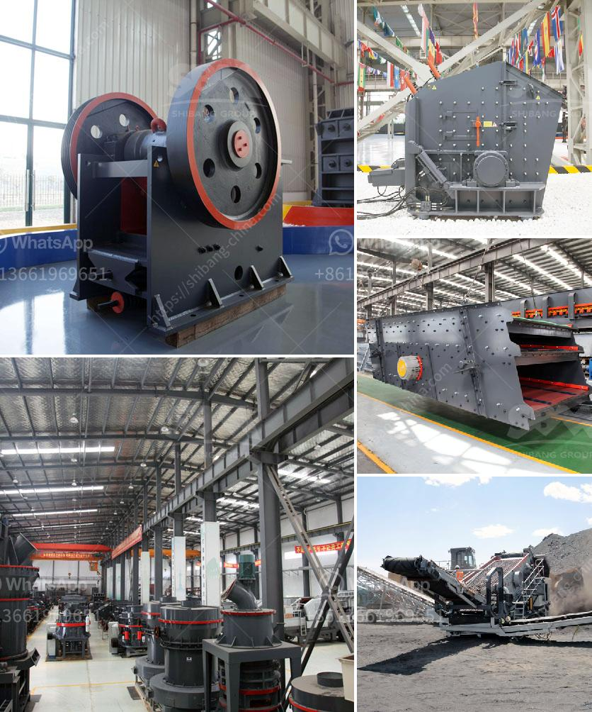

<h3>stone crusher design philippines</h3>
The Philippines is renowned for its rich natural resources, which include gold, copper, nickel, and chromite. The mining industry plays a crucial role in the country's economic development, contributing to nearly 10% of its GDP. With the discovery of these vast mineral deposits, there is a growing demand for stone crushers to process these minerals efficiently.

A stone crusher is a machine used to crush rocks into smaller pieces, usually for gravel or some other road or building application. Most stonecrushers have a hopper at the top, a container that holds the rock above the crusher and uses gravity to feed it in. Alternately, rock crushers can use a belt drive to continuously transport the rock into the crusher.

Stone crushers in the Philippines are designed to operate in accordance with industry standards, ensuring dependability and reliability. They are built with advanced technologies and made from high-quality materials to ensure high performance and long life.

When designing stone crushers in the Philippines, several important factors should be considered. Firstly, stone characteristics and requirements must be taken into account. Different types of stone have different hardness levels. For instance, limestone and granite are relatively soft stones, while basalt and quartz are much harder. The hardness of the stone determines the size and power requirements of the crusher. Additionally, the stone's moisture content needs to be determined as well, as moisture affects crusher performance.

Secondly, the desired end product size and shape should be defined. Stone crushers in the Philippines offer varying degrees of reduction, allowing the end product to be processed into smaller rocks, gravel, or dust particles. The size and shape requirements will impact the choice of crusher type and settings.

Thirdly, the throughput capacity should be considered. The throughput capacity of a stone crusher determines its efficiency and productivity. It is essential to select a stone crusher with an appropriate capacity that matches the expected volume of material being processed.

Furthermore, ease of maintenance and operation are crucial factors to consider when designing stone crushers. Maintenance costs can significantly impact the total cost of ownership of a crusher. Therefore, stone crushers in the Philippines are designed with features that make maintenance and repair easier, while ensuring safe operation. These include features like hydraulic adjustment settings, which allow for quick and easy changes to the crusher's settings to optimize performance.

In conclusion, stone crushers in the Philippines are designed to meet the unique requirements of the country's mining industry. With a wide range of available models and their ability to process materials efficiently, they contribute to the development of the country's economy. By considering factors such as stone characteristics, desired end product size, and throughput capacity, stone crushers are designed to provide reliable and efficient crushing operations in the Philippines.
<h3>Contact us</h3><ul><li><strong>Whatsapp:&nbsp;<a href="https://wa.me/8613661969651">+8613661969651</a></strong></li><li><a href="https://swt.shibang-china.com/?git&amp;zhl&amp;stone crusher design philippines"><strong>Online Service(chat now)</strong></a></li></ul><h3>Related</h3><ul><li><a href='harga stone crusher kapsitas 20 ton.md'>harga stone crusher kapsitas 20 ton</a></li><li><a href='price list sag mill for sale.md'>price list sag mill for sale</a></li><li><a href='ball mill hou feng in china.md'>ball mill hou feng in china</a></li><li><a href='crushing machine malaysia.md'>crushing machine malaysia</a></li><li><a href='metal corn crusher in china.md'>metal corn crusher in china</a></li></ul>