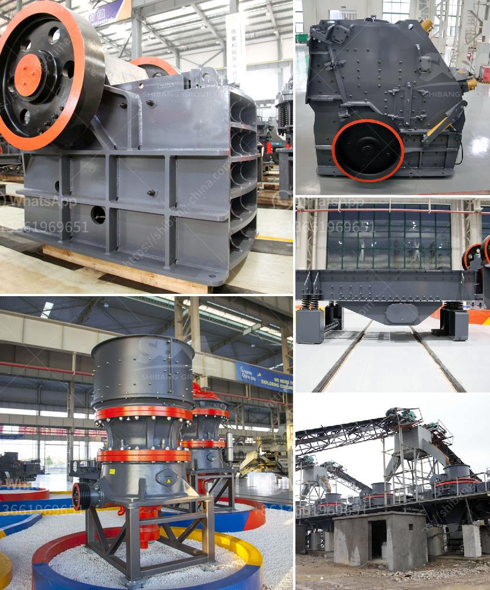

<h3>stone crusher finance project myanmar</h3>
Stone crushing units in Myanmar are majorly located in rural areas. However, it is difficult to finance these units due to their lack of creditworthiness and limited income generation potential. In order to address this issue, the government of Myanmar has allocated a significant budget for the development of stone crusher projects.

Stone crusher units in Myanmar are characterized by high capital costs, scarcity of skilled workers, and lack of spare parts. However, with proper planning and coordination, it is possible to achieve success in these projects. The government has introduced various financial schemes and initiatives to help budding entrepreneurs and stone crushing units.

One of the key initiatives in this regard is the establishment of the Stone Crusher Finance Scheme. Under this scheme, entrepreneurs can avail loans to purchase necessary machinery and equipment for stone crushing units. The loans are provided at a subsidized interest rate, making it affordable for entrepreneurs to invest in this sector.

In addition to providing financial assistance, the government is also offering technical support and training to entrepreneurs. This includes capacity building programs to enhance the skills and knowledge of stone crusher operators. These programs aim to improve the efficiency and productivity of stone crushing units, thereby increasing their income generation potential.

Moreover, the government has established stone crusher clusters in different parts of the country. These clusters serve as a platform for knowledge sharing and collaboration among stone crusher operators. Here, entrepreneurs can exchange information, share best practices, and collectively address common challenges. This collaborative approach has proved to be instrumental in the success of stone crusher projects in Myanmar.

Furthermore, the government has also focused on promoting sustainable practices in stone crushing units. This includes the use of advanced machinery and technology to minimize environmental impact. Stone crushers are now equipped with dust suppression systems, noise reduction measures, and efficient fuel consumption systems. These upgrades not only help in reducing pollution, but also contribute to the overall sustainability of the projects.

In conclusion, stone crusher finance projects in Myanmar have the potential to boost the rural economy and generate employment opportunities. The government's initiatives in providing financial assistance, technical support, and training have paved the way for the success of these projects. With proper planning, coordination, and sustainable practices, stone crushing units in Myanmar can contribute to the economic development of the country.
<h3>Contact us</h3><ul><li><strong>Whatsapp:&nbsp;<a href="https://wa.me/8613661969651">+8613661969651</a></strong></li><li><a href="https://swt.shibang-china.com/?git&amp;zhl&amp;stone crusher finance project myanmar"><strong>Online Service(chat now)</strong></a></li></ul><h3>Related</h3><ul><li><a href='industr gold mining equipment and prices.md'>industr gold mining equipment and prices</a></li><li><a href='grinding mill for limestone italy in bergamo.md'>grinding mill for limestone italy in bergamo</a></li><li><a href='jaw crushing machine.md'>jaw crushing machine</a></li><li><a href='complete stone crushing.md'>complete stone crushing</a></li><li><a href='ball mill suppliers.md'>ball mill suppliers</a></li></ul>