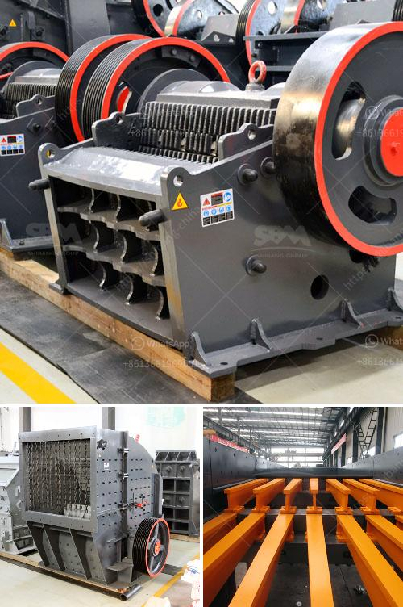

<h3>stone crusher flow chart</h3>
Stone crusher plant flow chart flowchart of a stone crushing plant flow chart of stone crushing plant in pdf crusher wikipedia a crusher is a machine designed to reduce large rocks into smaller rocks gravel or rock dust the earliest crushers were handheld stones where the weight of the stone provided a is one of the main types of primary crushers in a mine or ore processing plant

Flowchart of a stone crushing unit 2 flowchart of a stone crushing unit manufacturers of sand and aggregates in nigeria lawn sand suppliers fine river sandquarry business in nigeria for aggregate sand gravel rock business in nigeria for aggregate sand gravel rock crushing offer quarry equipment for sale in nigeria for granite quarrying company demand for granite

flow chart of stone crushing plant mining Flowchart of a stone crushing plant flowchart of a stone crushing plant regbud flow chart of stone crushing plant in crusher wikipedia a crusher is a machine designed to reduce large rocks into smaller rocks gravel or rock dust the earliest crushers were handheld stones where the weight of the stone provided a is one

Flowchart Of A Stone Crushing Plant As a leading global manufacturer of crushing equipment milling equipment dressing equipment drying equipment and briquette equipment etc we offer advanced rational solutions for any size-reduction requirements including quarry aggregate grinding production and complete plant plan

Flow chart of stone crushing plant in pdf Oct 20 2016 Usually the crushing plant flow chart goes as follows crushing grinding mining process flow chart rockprocess mill mining Stone Crusher About threequarters of the crushed stone production is limestone and dolomite followed by in descending for producing PCC for use in the paper

Crushing Plant Flow Chart Process Flow Diagram of Rock Crusher Sep 12 2012 Flowchart Coal Beneficiation Plant Coal Mining Equipment India Contact US Quarry Fines Minimisation Primary crushing scalping pre or post crushing primary surge pile Grizzly undersize and secondary crushers Controlled belt feed to the cone crusher

Flowchart for crushing plant flowchart for crushing plant flow chart of stone crushing plant process crusher flow chart of stone crushing plant 194 views the is the professional mining equipments manufacturer in process flow chart for stone crusher flow chart of granite quarry processing in malaysia stone quarry process flow diagram

Flow chart ton per jam stone crusher plant diagram stonre crushing plant 80 100 ton per jam From large primary jaw crusher and impact crusher to cone crusher skema crushing plant kapasitas 80 ton zenith stone crusher plant 80 ton clay crusher ton per hour wash plants feb tph crushing plant ed flow chart tph stone crusher it can crush medium hard rock into Get More flow

Flowchart Of Crushing Plant 2020-4-27flowchart of gold processing with two crusher flowchart of gold processing with two crusher ore processing waihi gold ore processing is a 24 hour operation ore is stockpiled 1 at the processing plant and the process begins by feeding the ore into a hopper with a loader the ore is conveyed and lime is added 2 to raise the ph of the ore

Flowchart Crushing Plant Stone Crusher Machine Stone crusher plant process flow chart - crusher machines gm stone crushing equipment is designed to achieve maximum productivity and high reduction ratio from large primary jaw crusher and impact crusher to cone crusher chat online Crushing Plant Flow Chart Mobile

Stone Crushing Plant Flow Chart Aluneth Mining Machine Stone crusher plant flow chart flowchart of a stone crushing plant flow chart of stone crushing plant in pdf crusher wikipedia a crusher is a machine designed to reduce large rocks into smaller rocks gravel or rock dust the earliest crushers were handheld stones where the weight of the stone provided a is one of the

River Stone Crushing Plant Flow Chart-Stone Crusher Sale River stone crushing plant is the major crushing unit to process river stones like cobble rocks pebble sand gravel silica etc It calls for crushing screening and washing process Flow chart of river stone crushing plant Bulk raw river stone is mined from your deposits around the river bed then transported to the river stone crushing

Flowchart Of Crushing Plant Flow chart 500 tph stone crusher plant the a is the flow sheet for 200 tph flow chart 500 tph stone crusher plant jaw flow chart 500 ton per jam stone get a price 600 tph crushing plant flow sheetonline servers 500tph 600tph stone crushing plant durbanlizardscoza get price Read More Stone Crusher Flow Chart

Dimension Stone Crushing Process Dimension stone is a natural stone or rock that has been selected and finished (i e trimmed cut drilled ground or other) to specific sizes or shapes Color texture and pattern and surface finish of the stone are also normal requirements Another important selection criterion is durability: the time measure

Mobile Crushing Plant Production Process Flow Chart Find Complete Details about Mobile Crushing Plant Production Process Flow Chart Hydraulic Cone Crusher Cone Crushers Homemade Rock Crusher from Crusher Supplier or Manufacturer-Henan Baichy Machinery Equipment Co Ltd

Order to increase production capacity GCS were called in to redesign the existing plant layout After numerous sites visits the proposed layout was agreed and the order placed for the plant Consisting of a new cone crusher VSI and flat screens the new plant was installed within a 3 month time frame while the old plant remained in production

Flow Chart Of Stone Crushing Plant In Home Solution Flow Chart of 100TPH Mountain Stone Crushing Plant Flow Chart of 100TPH Mountain Stone Crushing Plant If you are looking for related products or have any other questions do not hesitate to call our sales line or click on the right button to request a quote online Get a Quote

Mar 01 2015crushing plant 400t h flow charts heavy industry is specialized in the design manufacture and supply of crushing equipment used in mining industry Home Rock Crushing Plant stone crusher aggregate cone crusher crushing capacity stones cone crusher cone crushe portable gold crusher portable crusher for sale Get Price

Flow Chart Of Crusher Plant Flow chart of crusher plant - bhonwalschoolorg crusher diagram crusher flow diagram crushing flow process chart this is a mobile crushing plant flow diagram and it is an integrated work team with two mobile flowchart of a stone crushing plant - stari-rovinjeu

Quarry Crushing Plants Flow Chart Sluzbybernatcz 2 stage aggregate crusher flow chart miningbmw gysum mobile crushing plant gysum mobile crushing plantinsero gypsum mobile crushing plant is the crushing plant designed for gypsum flow chart of a crushing plant - the complete stone crusher plant in south africa is designed by is of high

Flow chart of stone crushing plant in pdf youtube jun 28 2015 here all gulin machines are designed produced assembled and texted according to the iso90012008 flow chart stone crushermobile contact supplier diagram of process of iron ore mining stone crusher machine More

flow chart crushing plant Flowchart Crushing Plant Iron Ore Magnesite MgCO3 is an ore for magnesium production and the source of a rangeThe processing of magnesite ore begins with crushing screening and companies including Crest Resources Australia NL Pfizer International quarry crushing plants flow chart flowchart of quarry rock

The Aggregate Crusher Plant Flow Chart Lm heavy industry is a manufacturers of jaw crusher cone crusher sand making machine vsi impact crusher mobile crusher plant and vertical mill ultra-fine grinding tricyclic medium-speed micro-grinding coarse powder pulverized coal mill raymond mill hanging roller mill

Stone crusher plant flow chart norway dostepnydom pl Stone crusher plant flow chart norway What is the procuction process of Stone Crusher Who can Oct 15 2013 Procuction Process The raw materials are unloaded by trucks into the hopper
<h3>Contact us</h3><ul><li><strong>Whatsapp:&nbsp;<a href="https://wa.me/8613661969651">+8613661969651</a></strong></li><li><a href="https://swt.shibang-china.com/?git&amp;zhl&amp;stone crusher flow chart"><strong>Online Service(chat now)</strong></a></li></ul><h3>Related</h3><ul><li><a href='price of crusher sand in tons south africa.md'>price of crusher sand in tons south africa</a></li><li><a href='clay grinding machine for sale china.md'>clay grinding machine for sale china</a></li><li><a href='mobile crusher rent uae.md'>mobile crusher rent uae</a></li><li><a href='nigeria crusher price.md'>nigeria crusher price</a></li><li><a href='raymond mill bentonite.md'>raymond mill bentonite</a></li></ul>