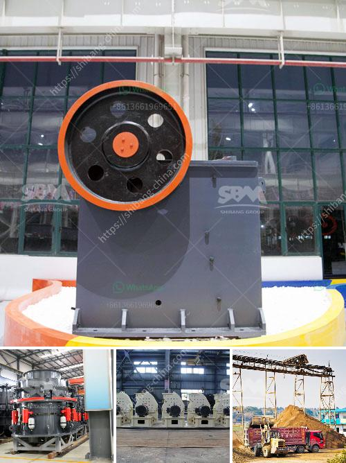

<h3>stone crusher for excavator cost</h3>
Stone crusher for excavator cost is a significant consideration in purchasing equipment for your construction business. It is essential to ensure that the equipment you choose is not only affordable but also durable and efficient. The stone crusher for excavator is an effective and reliable attachment that offers versatility and efficiency in the construction industry. 

Excavators are heavy machinery widely used in construction, mining, and other industries. They are primarily used for digging, demolition, and earthmoving tasks. However, with the right attachment, excavators can also be used for crushing stones and rocks. This is where the stone crusher for excavator comes into play.

The stone crusher for excavator is a powerful hydraulic attachment that can crush rocks and stones effortlessly. It is a valuable addition to any construction site because of its productivity and versatility. With a stone crusher, you can crush stones in different sizes, making it suitable for a variety of applications.

One of the primary factors to consider when purchasing a stone crusher for excavator is the cost. The cost of the attachment can vary depending on various factors such as the brand, model, and specifications. In general, stone crushers for excavators are available in different price ranges, ranging from a few thousand dollars to tens of thousands of dollars.

The cost of the stone crusher for excavator will also depend on the power and reach of the attachment. Higher-powered stone crushers can crush rocks more efficiently, but they may come at a higher price. Similarly, stone crushers with longer reach are suitable for bigger construction sites, but they can also be more expensive.

When considering the cost of a stone crusher for excavator, it is crucial to weigh the benefits and potential returns on investment. A good-quality stone crusher can significantly increase your productivity and minimize downtime, ultimately leading to cost savings. Additionally, investing in a reliable and efficient stone crusher can also improve the overall efficiency and reputation of your construction business.

While the initial cost of a stone crusher for excavator may seem high, it is important to consider the long-term benefits. A durable and efficient stone crusher can withstand challenging working conditions and have a longer lifespan, reducing the need for frequent replacements or repairs. This can significantly reduce maintenance costs in the long run.

Another consideration when evaluating the cost of a stone crusher for excavator is the availability and cost of spare parts. Investing in a popular brand or a widely-used stone crusher attachment can ensure that spare parts are readily available and relatively affordable. This can be beneficial in terms of maintenance and repair costs.

In conclusion, the cost of a stone crusher for excavator is an important factor to consider when purchasing construction equipment. While the initial cost may seem high, it is crucial to evaluate the long-term benefits and potential returns on investment. Investing in a durable and efficient stone crusher can improve productivity, reduce maintenance costs, and enhance the overall efficiency of your construction business.
<h3>Contact us</h3><ul><li><strong>Whatsapp:&nbsp;<a href="https://wa.me/8613661969651">+8613661969651</a></strong></li><li><a href="https://swt.shibang-china.com/?git&amp;zhl&amp;stone crusher for excavator cost"><strong>Online Service(chat now)</strong></a></li></ul><h3>Related</h3><ul><li><a href='used mobile hammer mills for sale.md'>used mobile hammer mills for sale</a></li><li><a href='raymond mill bentonite.md'>raymond mill bentonite</a></li><li><a href='used clinker grinding mill for sale.md'>used clinker grinding mill for sale</a></li><li><a href='mica processing machinery pictures.md'>mica processing machinery pictures</a></li><li><a href='double roll crusher indonesia.md'>double roll crusher indonesia</a></li></ul>