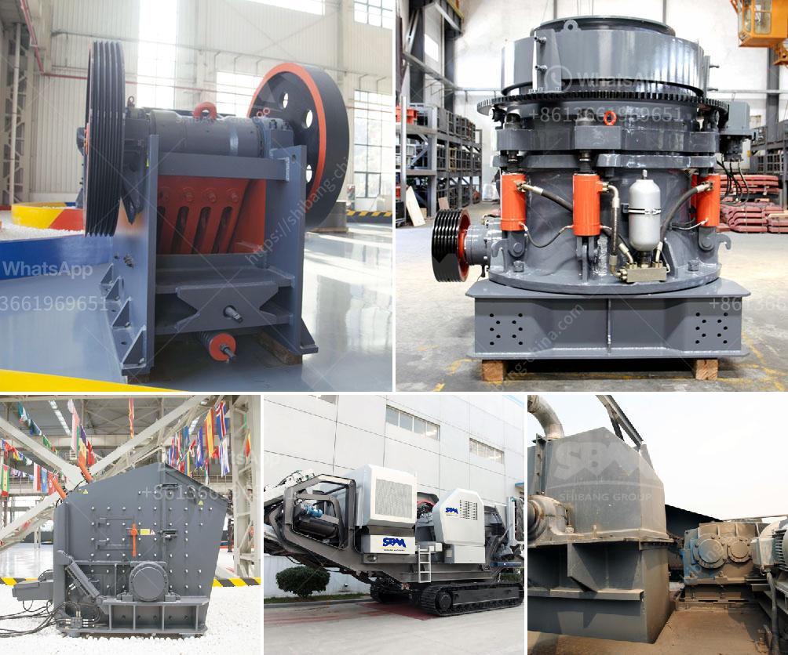

<h3>stone crusher for gold mining indonesia</h3>
Stone crushers are used in various mining operations, including gold mining, to crush rocks and ore materials. However, not all crushers are designed to handle large pieces of rocks. That's why you need to invest in a powerful stone crusher for gold mining activities. This is particularly important in Indonesia, where mineral deposits are abundant and gold mining is widespread.

To ensure reliable performance and smooth operation, gold mine operators should consider the following aspects when selecting the right stone crusher:

1. Crushing circuit design optimization for improved efficiency: The jaw crusher is a versatile and essential crushing tool used for primary crushing of various materials, including hard rocks, coarse and fine ore. The hydraulic cone crusher is commonly used for secondary crushing. This cone crusher features a unique combination of crusher speed, throw, and cavity design, providing higher capacity and superior product quality.

2. Robust construction and high durability: A stone crusher for gold mining requires a sturdy frame and robust design to withstand the demanding conditions of the mining environment. It should be manufactured using high-quality materials that resist impact, vibration, and corrosion.

3. Powerful crushing capabilities: To crush large rocks into finer particles, choose a stone crusher with a high crushing ratio. This ratio is the relationship between the size of the input material and the size of the output product.

4. Ease of maintenance: Gold miners need crushers that can be easily maintained and repaired. Consider stone crushers with accessible parts and a simple structure for hassle-free maintenance.

5. Energy efficiency: Opt for crushers that consume less power while delivering high performance. Energy-efficient crushers not only help reduce operational costs but also minimize carbon emissions.

Investing in a reliable stone crusher for gold mining operations in Indonesia will not only optimize the gold mining process but also contribute to environmental preservation. Additionally, crushers are more cost-effective than other methods of crushing materials like manually picking, which is credited to saving costs for investment areas. Further, these crushers are easily transported and installed at the desired mining site, making them highly convenient for gold miners.

In conclusion, stone crushers are essential equipment in gold mining activities, specifically in Indonesia, where the mineral resources are abundant. Investing in the right stone crusher for gold mining will provide immense benefits, including high efficiency, durability, robust construction, energy efficiency, and ease of maintenance. Therefore, it is crucial to conduct proper research and select a reliable stone crusher that meets your gold mining requirements.
<h3>Contact us</h3><ul><li><strong>Whatsapp:&nbsp;<a href="https://wa.me/8613661969651">+8613661969651</a></strong></li><li><a href="https://swt.shibang-china.com/?git&amp;zhl&amp;stone crusher for gold mining indonesia"><strong>Online Service(chat now)</strong></a></li></ul><h3>Related</h3><ul><li><a href='aggregate crusher supplier tanzania.md'>aggregate crusher supplier tanzania</a></li><li><a href='nigeria crusher price.md'>nigeria crusher price</a></li><li><a href='screw conveyor for sand.md'>screw conveyor for sand</a></li><li><a href='copper ore processing plant in philippines.md'>copper ore processing plant in philippines</a></li><li><a href='jaw crusher price philippines.md'>jaw crusher price philippines</a></li></ul>