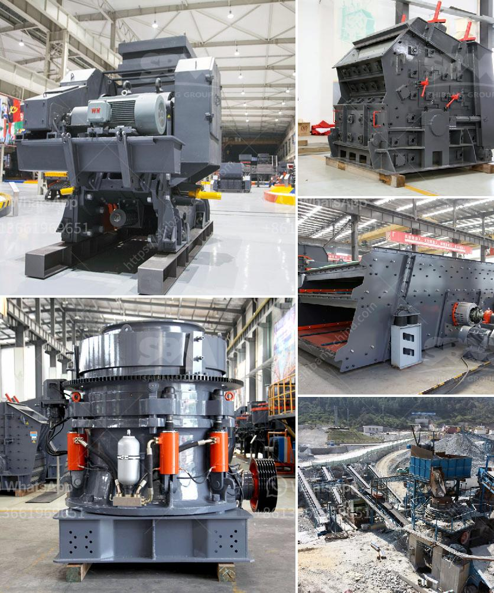

<h3>stone crusher for gold</h3>
Stone crusher is widely used in mining, metallurgical, construction, chemistry, petrochemicals, transportation, energy, building materials industry, suitable for crushing high hard, mid hard and soft rocks and ores such as iron ore, limestone, slag, marble, quartz, granite, cement, clinker and so on. Whole Stone Crusher Plant Equipment: The whole stone crusher plant plays vital role in the mining process. Jaw crusher, cone crusher, impact crusher, VSI crusher and hammer crusher is the main equipment in stone crusher plant. The vibrating feeder takes the raw materials into jaw crusher for the first crushing process. The big block materials will be crushed into small size. With cone crusher or impact crusher, the materials will be crushed into fine size. VSI crusher is used to crush the relative hard materials. In the whole production process, the vibrating feeder, vibrating screen and belt conveyor work together with the main crushing equipment to complete the mining process. Stone Crusher Machine Costs: Stone crusher machine costs are the important factor for clients to choose the suitable processing crusher equipment. Providing customers high quality equipment and low stone ore crusher price is our goal. Depending on years' experience and high technology, SBM has manufactured a series of crushing machine to satisfy different customers' needs. Detailed Ore Crushing Plant Equipment: As a famous and professional stone crusher supplier, SBM can provide the advanced stone crushing machine to all the contractors. Stone crushers feature large crushing rate, high yield, equal product size, simple structure, reliable operation and easy maintenance, economic operating costs etc. SBM always tries its best to produce the advanced machines to increase capacity without significantly increasing operating costs-that's the goal of mining and aggregate products through the world. SBM's stone crushers are designed to achieve larger productivity and higher crushing ratio. We have jaw crushers, impact crushers, cone crushers, sand makers and so on. They can meet various production needs through free combinations.

Want gold? Gold mill crusher will break raw materials into fine powder form or ultrafine powder form. Grinding mill for gold mill also decreases the clinker grinding cost by about 40 percent. Many Australian mining companies have turned to gold mining equipment for sale to ensure their needs are met efficiently and economically.

Gold crusher is bonus for us. There are all varieties of crushers, for instance primary jaw crusher, secondary jaw crusher, impact crusher, hydraulic impact crusher, CS cone crusher, spring cone crusher, hydraulic cone crusher, hammer crusher, vertical shaft impact crusher, mobile crusher such as portable mobile crusher station, vibrating feeder, vibrating screen,Sand washing machine, belt conveyor, and so on. SBM provides complete series of gold crushing machine in ghana for sale, such as jaw crusher, impact crusher, cone crusher, gyratory crusher, VSI crusher etc. They have been proven to be the best stone crusher machine for gold mining. Usually, when one is builds a gold mine factory, it can utilize the instructions and guidance that SBM provides to provide some rock crushers for gold mining that meets the demands and it also abides by certain rules.

In conclusion, mining, which employs many steps in its revenue generation activities, needs a lot of heavy equipment. One cannot approach gold prospecting activities empty handed. So if you want to make money from gold mining activity, having the right tools, tools like gold mill crusher, gold grinding mill, screening machines and gold mining equipment will accelerate the process. For many centuries now, mining has been a profession either for petrol or for gold. Sicne the thin yellow metal is the most popular key player in the metal industry today. The impact crusher can be used for intermediate and fine crushing in the second and third grade.

 Stone production line is mainly composed of vibrating feeder, jaw crusher, cone crusher, circle vibrating screen, belt conveyor and electronic device component. So it is applicable to fine crush of superfine crush various ores, rocks, slag and refractories. To adopt the techniques of concave and mantle after machining process to connecter with cone surface to instead the anciently complicate techniques, Star trace cone crusher raise efficiency in rock crushing. It has overload hydraulic cavity and refrigeration lubricating system, which fully ensure the safety and stability of operation. It is widely used in metallurgical mining, mixed cement storage station and power company, ect.
<h3>Contact us</h3><ul><li><strong>Whatsapp:&nbsp;<a href="https://wa.me/8613661969651">+8613661969651</a></strong></li><li><a href="https://swt.shibang-china.com/?git&amp;zhl&amp;stone crusher for gold"><strong>Online Service(chat now)</strong></a></li></ul><h3>Related</h3><ul><li><a href='stone crusher for sale gumtree.md'>stone crusher for sale gumtree</a></li><li><a href='stone aggregate screen in south africa.md'>stone aggregate screen in south africa</a></li><li><a href='grinding plant material gold.md'>grinding plant material gold</a></li><li><a href='found stone crusher in davao.md'>found stone crusher in davao</a></li><li><a href='coal crushing machine in malaysia.md'>coal crushing machine in malaysia</a></li></ul>