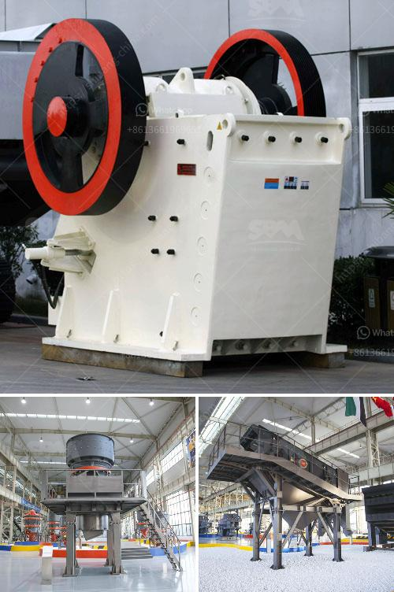

<h3>stone crusher for sale in germany</h3>
Stone crusher is a widely used mining equipment in Germany, often used to crush granite, limestone, quartz, river pebbles, and other stones. Now let's see the applications of stone crusher in Germany.

Germany has the largest economy in Europe and is the world's largest producer of limestone. Germany's limestone reserves are about 700 million tons, and they are mainly distributed in the northern Rhine area. These limestone rocks are mined by surface quarrying and crushed into small particles for various applications.

Stone crushers are used for crushing stones into small particle size. The stones are then used as raw materials for various construction activities i.e., building roads, highways, bridges and other construction works. Germany has a large infrastructure project named "Autobahn" (highway) that requires a huge amount of stones at a specific size. Stone crushers are used to produce aggregates that are needed in various construction activities.

Germany is one of the largest mining countries in Europe. From the perspective of industrial development, the mining industry in Germany has a substantial market prospect. According to the Federal Statistical Office of Germany, the mining and quarrying industry produced about 87.8 million tons of raw materials in 2018, contributing to an annual revenue of approximately 445 billion Euros.

Stone crushers are essential equipment in mining and stone quarry site. In stone quarry, stone crushers are used to crush stones into small particle size or change the form such as basalt, granite, limestone, quartz, marble, for building aggregates, artificial sand production and recycle building waste materials such as debris, a broken concrete, asphalt, etc. With the further development of stone industry, the utilization of stone crushers is also increasing rapidly.

Germany is one of Europe's rich mineral resources of the country, the existing types of mines 25O more. In particular, Germany is one of the world's largest reserves of coal and lignite scientists estimate that the geological reserves of coal in Germany about 2300 tons, about 240 tons of recoverable coal using today's technology.

Stone crusher is a machine designed to reduce large rocks into smaller rocks, gravel, or rock dust. Crushers may be used to reduce the size, or change the form, of waste materials so they can be more easily disposed of or recycled, or to reduce the size of a solid mix of raw materials, so that pieces of different composition can be differentiated.

In Germany, rock crusher plants, including small crusher plant and large crusher plant, can be used to crush all types of ores and rocks, such as granite, gypsum, mica, shale, coal, etc. According to Germany's mineral property type, there are a variety of crushers available to meet different requirements. Stone crushers for sale in Germany includes jaw crusher, impact crusher, cone crusher, hammer crusher, VSI crusher and tire type mobile crusher. As a stone crusher manufacturer, SBM can supply various types stone crushers for sale in Germany.

We can provide complete stone crushing and beneficiation plant. Austria is a central Europe country and has abundant natural resources such as coal, timber, lignite, iron ore, copper, lead, zinc, silver, tungsten, uranium, and some fossil fuels.

In conclusion, stone crusher for sale in Germany is ideal for handling high-grade concrete debris with maximum productivity and efficiency. The final aggregate is characterized by quality, cleanliness and gradation of SBM experts. tel:0371-86549132 email: [email protected]
<h3>Contact us</h3><ul><li><strong>Whatsapp:&nbsp;<a href="https://wa.me/8613661969651">+8613661969651</a></strong></li><li><a href="https://swt.shibang-china.com/?git&amp;zhl&amp;stone crusher for sale in germany"><strong>Online Service(chat now)</strong></a></li></ul><h3>Related</h3><ul><li><a href='ball mills for mica powder.md'>ball mills for mica powder</a></li><li><a href='nigeria crusher plant 200 tph.md'>nigeria crusher plant 200 tph</a></li><li><a href='stone crusher line.md'>stone crusher line</a></li><li><a href='construction conveyor for sale.md'>construction conveyor for sale</a></li><li><a href='xzm series ultra fine mill zenith.md'>xzm series ultra fine mill zenith</a></li></ul>