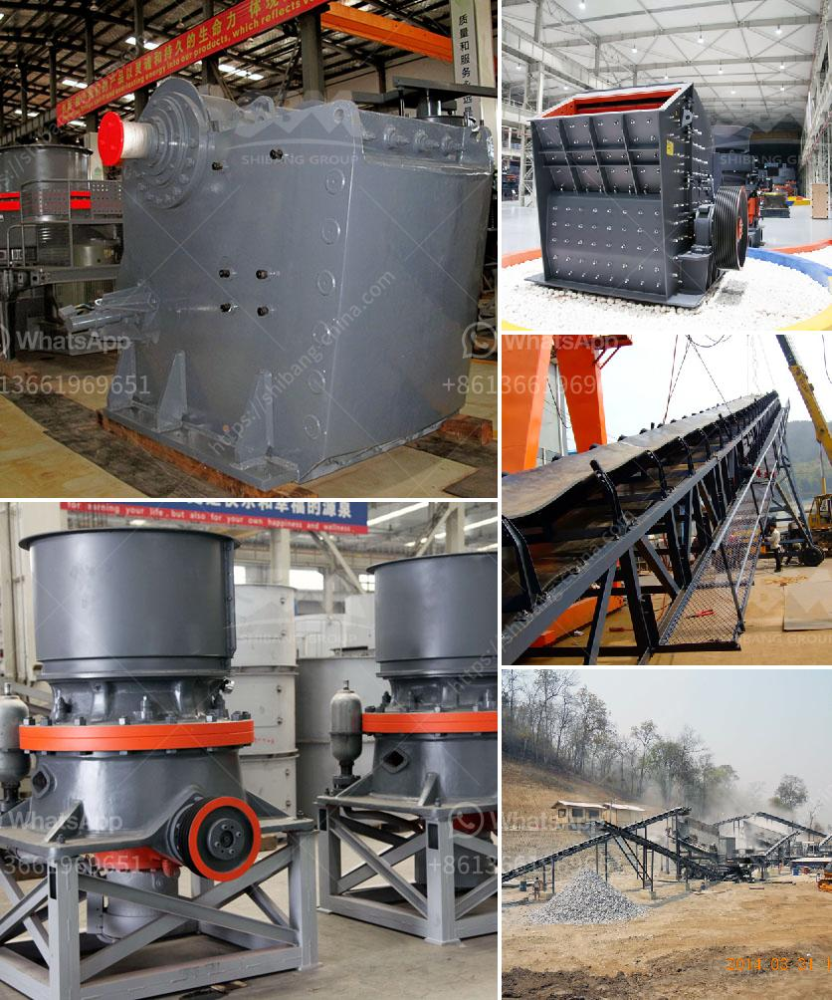

<h3>stone crusher for sale in usa</h3>
Stone crusher for sale in USA is designed to crush and reduce the size of large rocks and gravel in different industries such as mining, metallurgy, building material, railway, construction and recycling applications. With reliable performance and high crushing capacity, stone crushers are highly demanded in the USA market.

Many factors influence the product efficiency and performance, including the type of crushing chamber and the eccentric throw. The crushing chamber in the USA stone crusher is larger, making the production capacity higher. The product can efficiently reach the required particle size and minimize the waste of material. If coarse material is fed into the machine, it will cause a high power consumption as well as an increased wear rate of the crushing parts. Therefore, it is crucial to choose the right crushing chamber for stone crusher to achieve optimal productivity.

Another important factor to consider when purchasing a stone crusher for sale in the USA is the product's design and layout. Different designs and layouts allow manufacturers to provide specific configurations to meet customers' requirements. For instance, there are stationary crushers and portable crushers available in the market. Stationary crushers are designed to stay in one place, while portable crushers can be transported to different locations. This flexibility is ideal for industries with temporary work sites or multiple locations. Additionally, the product's layout should be user-friendly, allowing for easy maintenance and serviceability.

Stone crushers for sale in the USA come in different sizes and power requirements. It is important to choose a crusher that is appropriate for the specific needs of your industry. Smaller crushers are typically used for residential or small-scale construction projects, while larger crushers are suitable for heavy-duty industrial applications. It is recommended to consult with a professional to determine the right crusher for your specific requirements.

In addition to the features and designs of stone crushers, it is essential to consider the after-sales support provided by the manufacturer or dealer. A reputable dealer will offer technical support, spare parts, and a warranty for their products. This ensures that any issues or problems with the crusher can be resolved promptly, minimizing downtime for your operations.

Stone crushers for sale in the USA are versatile machines that can handle a wide range of materials. They are ideal for rock crushing, gravel extraction, mining, construction, demolition, recycling, and more. When purchasing a stone crusher, it is important to research and evaluate different options to ensure that you choose the best machine for your needs. Consider factors such as the type of crushing chamber, design and layout, power requirements, and after-sales support. By investing in a high-quality stone crusher, you can boost productivity and efficiency in your operations, ultimately maximizing your return on investment.
<h3>Contact us</h3><ul><li><strong>Whatsapp:&nbsp;<a href="https://wa.me/8613661969651">+8613661969651</a></strong></li><li><a href="https://swt.shibang-china.com/?git&amp;zhl&amp;stone crusher for sale in usa"><strong>Online Service(chat now)</strong></a></li></ul><h3>Related</h3><ul><li><a href='mobile stone crusher south africa.md'>mobile stone crusher south africa</a></li><li><a href='aggregate crushing machines.md'>aggregate crushing machines</a></li><li><a href='quartz stone crushing plant.md'>quartz stone crushing plant</a></li><li><a href='mineral materials crusher.md'>mineral materials crusher</a></li><li><a href='iron processing plant price.md'>iron processing plant price</a></li></ul>