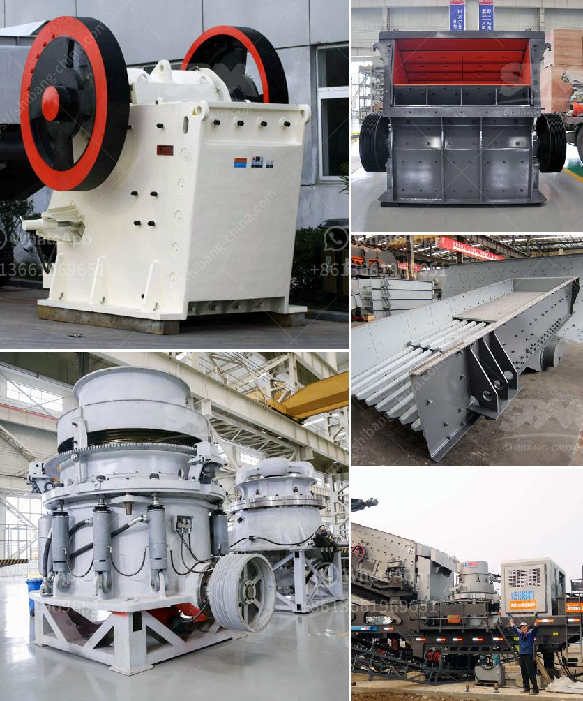

<h3>stone crusher for sale philippine</h3>
Stone crusher for sale Philippine, as the world's leading manufacturer of crushing equipment, grinding equipment, beneficiation equipment, drying equipment and briquetting equipment, we provide free installation, reasonable solutions, including quarries, aggregate yards, grinding yards and complete factory plans .

In the Philippines, the construction industry has been playing a vital role in the country's economic growth. With the overall stability of the government policies, the infrastructure construction has entered a period of rapid development, which requires a large amount of construction sand and gravel aggregates. With the increasing demand for building materials, the stone crusher industry is becoming more and more popular in the Philippines.

Stone crushers are used to break stones into smaller sized pieces and pebbles. Stone crusher machines are sold in Philippines, including in mining industry, construction industry, metallurgy industry and chemical industry.

The materials that can be crushed by stone crusher machines include limestone, granite, quartz, basalt, pebble, bluestone, iron ore, rock, stone, gypsum, river stone, cement clinker, coal, and other minerals. The Philippine government stipulates that quarries should only be established or operated within a 1,500-meter radius from concrete batching plants and asphalt mixing plants. However, no restrictions are imposed on the size and nature of stones that can be extracted.

A stone crusher for sale can be easily found in the Philippines. With a wide availability of stone crushers in the market, buyers may easily find the right equipment that meets their requirements. However, for those who are new to stone crushing equipment, it is important to know that a stone crusher is a powerful machine used to crush stones into smaller sized pieces.

There are various types of stone crushers for sale Philippines. More common types are PE jaw crusher, PF impact crusher, VSI crusher, PC hammer crusher and mobile crusher. Among these crushers, jaw crusher is the most commonly used primary crushing equipment in crushing plant. In this article, we mainly talk about the stone crusher for sale in the Philippines.

Crushing capacity: It is commonly known that the stone crusher has a large crushing capacity, and actually the stone crusher is divided into two types according to its crushing capacity, namely, small stone crusher and large stone crusher.

Small stone crusher: With an hourly output of 1-60 tons of gravel aggregates, small stone crushers are mainly used for household or small infrastructure construction, transportation and other fields. This type of crusher requires a small site, low investment, quick return and flexibility.

Large stone crusher: With an hourly output of 200-1000 tons, this type of crusher is commonly used in large-scale infrastructure projects, such as highways, railways, water conservancy and hydropower, as well as construction and mining fields. Large stone crushers require a relatively large site, high investment cost, long construction period, and they need to be equipped with a variety of equipment to meet different production needs.

In summary, the stone crusher for sale in the Philippines is a great investment. Buyers can choose from a variety of equipment to meet their production needs, and choose the appropriate type of crusher to achieve their desired crushing output. At Aimix, we offer a wide range of stone crushers that can be customized according to your specific needs. Contact us today and let us help you find the perfect stone crusher for your Philippine project.
<h3>Contact us</h3><ul><li><strong>Whatsapp:&nbsp;<a href="https://wa.me/8613661969651">+8613661969651</a></strong></li><li><a href="https://swt.shibang-china.com/?git&amp;zhl&amp;stone crusher for sale philippine"><strong>Online Service(chat now)</strong></a></li></ul><h3>Related</h3><ul><li><a href='project report for establishing stone crusher.md'>project report for establishing stone crusher</a></li><li><a href='production of cement mill in africa.md'>production of cement mill in africa</a></li><li><a href='zimbabwe hammer mills.md'>zimbabwe hammer mills</a></li><li><a href='mobile crusher hire kenya.md'>mobile crusher hire kenya</a></li><li><a href='alluvial gold washing plant in zimbabwe.md'>alluvial gold washing plant in zimbabwe</a></li></ul>