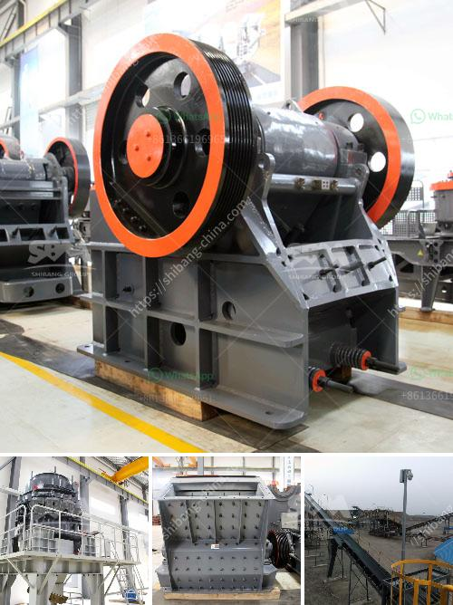

<h3>stone crusher in thailand</h3>
Stone crushing plays a pivotal role in Thailand, offering ample opportunities for entrepreneurs to take advantage of the boom. From stone mining and crushing to cement production and concrete mixing, Thailand is a leading destination for both natural and crafted stones.

Stone crusher is an essential equipment that is widely used in mine, quarrying, road construction, building, etc. Being a dependable entity, it contributes to substantial influx of revenue for the industry. However, there are various types of stone crushers available in the market, including jaw crusher, cone crusher, impact crusher, hammer crusher, and various other types.

In Thailand, where the land is filled with rocks and stones, stone crushers play a vital role. Not only do they break down large rocks into smaller pieces, but they also help in removing unwanted material from the rocks. Stones are collected from quarries, and the stone crusher helps in reducing their size, making it easier to transport and use in construction activities.

Moreover, stone crusher in Thailand is widely applied in various industries, such as mining, construction, metallurgy, railways, water conservancy, chemicals, and more. The stone crushing process involves multiple stages, each requiring different machines to aid the process. Jaw crushers are commonly used for primary crushing; cone crushers for secondary crushing; and impact crushers for tertiary crushing. These crushers are designed to handle different types of stones with varying hardness levels.

Since Thailand is experiencing rapid urbanization and infrastructure development, the demand for stones and crushers is rising rapidly. This, in turn, is leading to the growth of the stone crusher industry in Thailand. Various manufacturers and suppliers are stepping up their game to meet the growing demand with advanced technology and high-quality equipment.

In conclusion, stone crushers are indispensable equipment for the stone crushing industry in Thailand. They help break down large rocks into smaller, more manageable sizes, making them easier to transport and use in various construction activities. As Thailand continues to witness development and growth, the demand for stone crushers is expected to surge further, presenting lucrative opportunities for entrepreneurs in the industry.
<h3>Contact us</h3><ul><li><strong>Whatsapp:&nbsp;<a href="https://wa.me/8613661969651">+8613661969651</a></strong></li><li><a href="https://swt.shibang-china.com/?git&amp;zhl&amp;stone crusher in thailand"><strong>Online Service(chat now)</strong></a></li></ul><h3>Related</h3><ul><li><a href='crusher for quartz.md'>crusher for quartz</a></li><li><a href='vertical shaft impact crusher plf.md'>vertical shaft impact crusher plf</a></li><li><a href='marble crusher machine philippines.md'>marble crusher machine philippines</a></li><li><a href='barite powder mill in india.md'>barite powder mill in india</a></li><li><a href='clay grinding machine.md'>clay grinding machine</a></li></ul>