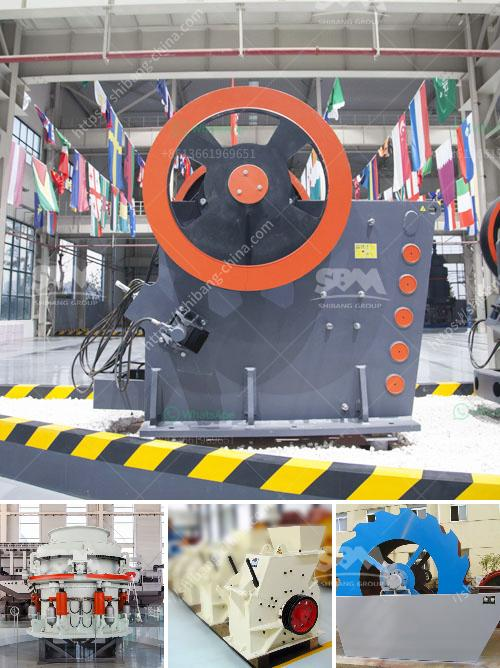

<h3>stone crusher line</h3>
Stone crushing line is a vital resource for construction projects of all sizes. With the ever-increasing demand for housing and infrastructure, the need for stone materials has never been greater. Therefore, it is essential to choose a suitable and efficient stone crusher line to support your project.

A stone crusher line is a machine composed by several machines and equipment that are used in various processes in stone mining, construction, infrastructure, and various other projects. The production capacity of this line varies, depending on the requirements of the clients.

One of the primary machines in a stone crusher line is a vibrating feeder. This machine feeds the material into the next machine, ensuring an uninterrupted and continuous flow of stones. The vibrating feeder can be designed as a vibrating grate or a powered feeder, depending on the material being processed and the desired output.

The next machine in the stone crusher line is the jaw crusher. This machine is used for primary crushing of various materials, including rocks, aggregates, granite, and other stones. The jaw crusher reduces the size of the rocks through the compression force exerted by two jaw plates. The crushed material can then be further processed by secondary and tertiary crushers.

Another essential machine in the stone crusher line is the vibrating screen. This machine is responsible for separating the crushed stones into various sizes. The vibrating screen can have multiple decks, allowing for the classification of stones according to their size. This ensures that the stones meet the required specifications for different purposes.

To ensure optimal performance and minimize downtime, stone crusher lines are equipped with various automation features. These features include advanced control systems, remote monitoring capabilities, and automatic lubrication systems.

In conclusion, a stone crusher line is an indispensable resource for any construction project. It provides the necessary materials for building houses, roads, bridges, and other essential infrastructure. By selecting a suitable stone crusher line with the necessary machines and equipment, you can ensure the smooth and efficient operation of your project, resulting in high-quality construction outcomes.
<h3>Contact us</h3><ul><li><strong>Whatsapp:&nbsp;<a href="https://wa.me/8613661969651">+8613661969651</a></strong></li><li><a href="https://swt.shibang-china.com/?git&amp;zhl&amp;stone crusher line"><strong>Online Service(chat now)</strong></a></li></ul><h3>Related</h3><ul><li><a href='cement vertical roller mill price.md'>cement vertical roller mill price</a></li><li><a href='quartz stone lining machinery.md'>quartz stone lining machinery</a></li><li><a href='ball mill plant in south africa.md'>ball mill plant in south africa</a></li><li><a href='sandstone crusher.md'>sandstone crusher</a></li><li><a href='hammer mill furniture.md'>hammer mill furniture</a></li></ul>