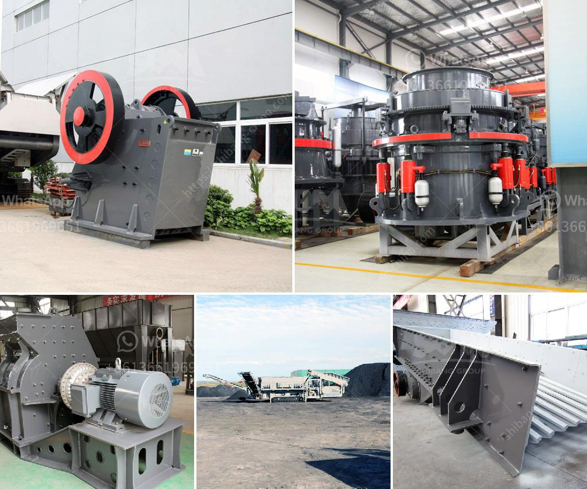

<h3>stone crusher machine from uk</h3>
The stone crusher machine in the UK is commonly used in infrastructure and mine exploitation projects. It is mainly used as a primary crusher and it can break large-sized stones or rocks into smaller pieces. Its features include high crushing ratio, high capacity, simple structure, reliable performance, easy maintenance, and low operation cost.

The stone crusher machine in the UK is widely used in various industries such as mining, building materials, highway, railway, water conservancy, and chemical industry. It is especially suitable for materials with Mohs hardness under the range of 5-10, such as limestone, granite, basalt, iron ore, quartz, sandstone, concrete, coal, and so on.

The stone crusher machine from the UK is an ideal choice for crushing rocks or ores. It is widely used in various ore crushing, railway, highway, energy, cement, chemical, construction, and other industries. Its nominal model feed size (mm) feed size (mm) discharge size (mm) mm (t/h) KW (rpm) weight (t)

PEX150×750 ≤120 ≤18-58 8-25 15 1200 3.8 PEX250×750 ≤210 ≤25-60 13-35 30-37 4006 5.5 PEX250×1000 ≤210 ≤25-60 16-52 37-45 3506 6.5 PEX250×1200 ≤210 ≤25-60 20-61 45-55 330 7.7

The stone crusher machine in the UK is designed with a crushing cavity tapers made of high-manganese steel lining plates. The rotor is made of manganese steel, and the jaw plate and the impact plate are castings of high-strength manganese steel. The side plates and beams are made of high-strength steel plates. The crushing chamber adopts a symmetrical "V" shape structure so that the actual width of the feed port is wider than the nominal width, which enables a larger amount of feed and increases the crushing capacity.

In conclusion, the stone crusher machine from the UK is widely used in various industries and provides high efficiency and low operating costs. With its strong crushing capacity and large feed size, the machine is an excellent choice for primary crushing. Its robust and durable construction ensures a long lifespan, making it a reliable investment for any mining or construction project.
<h3>Contact us</h3><ul><li><strong>Whatsapp:&nbsp;<a href="https://wa.me/8613661969651">+8613661969651</a></strong></li><li><a href="https://swt.shibang-china.com/?git&amp;zhl&amp;stone crusher machine from uk"><strong>Online Service(chat now)</strong></a></li></ul><h3>Related</h3><ul><li><a href='stone crusher plant ton per hour.md'>stone crusher plant ton per hour</a></li><li><a href='industr gold mining equipment and prices.md'>industr gold mining equipment and prices</a></li><li><a href='cement manufacturing process flow chart.md'>cement manufacturing process flow chart</a></li><li><a href='bauxite calcination plant cost in india.md'>bauxite calcination plant cost in india</a></li><li><a href='chinese tracked stone crushers.md'>chinese tracked stone crushers</a></li></ul>