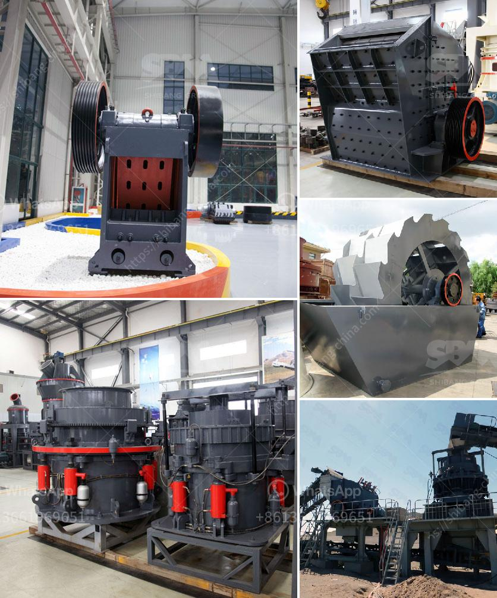

<h3>stone crusher machine in pakistan</h3>
Stone crushing machine is used to crush stones into small size or change the form such as limestone, quartz, marble, granite and recycle building waste materials such as debris, asphaltic cement concrete. Usually in stone crushing plant, we crush stones into small particles with diameter of 10mm, 12mm, 19mm, 25mm, 50mm, 100mm. Our stone crusher machine are widely used in crushing limestone ,silica, mica, quartz, basalt, chrome , dolomite, feldspar, fluorite, kaolin ore, marble , granite in Pakistan.

Manganese ore crushing plant includes: The jaw crusher, the hammer mill, the grinding mill machine, the classifier, the vibrating screen, belt conveyor and the focus electric control and other auxiliary equipment plete set of stone crusher machine in pakistan

Manganese ore crushing plant includes: The jaw crusher, the hammer mill, the grinding mill machine, the classifier, the vibrating screen, belt conveyor and the focus electric control and other auxiliary equipment plete set of stone crusher machine in pakistan.

Stone crushing machine in pakistan is widely used for rock crushing plant for building aggregate and sand gravel production. As a stone crusher machine supplier in Pakistan, SBM Company can offer the complete stone crushing plant, which include not only the single stone crusher machine, but also grinding mill, grizzly feeder, vibrating screen, belt conveyor and washing machine. We also design the stone crushing process according to the final size and capacity requirements for marble, silica sand, limestone, coal, calcium carbonate, talc, barite, clay, gypsum, graphite, bentonite, and so on. So many mining practices have proved that PEW Series jaw crusher produced by SBM performs as an efficient copper ore crushing plant in Malaysia’s copper quarries. Besides mining copper, PEW series jaw crushers have some other applications, used as the stone crusher, copper ore crusher, bauxite crusher, coal crusher and cement crusher, etc. The anti-pressure of PEW jaw crusher can achieve to 280Mpa, and the feeding size can reach 930mm. Meanwhile, world-class manufacture crafts and high-tech materials are adopted in the PEW Jaw crusher, which makes it very suitable for the situation of copper mining industry.
<h3>Contact us</h3><ul><li><strong>Whatsapp:&nbsp;<a href="https://wa.me/8613661969651">+8613661969651</a></strong></li><li><a href="https://swt.shibang-china.com/?git&amp;zhl&amp;stone crusher machine in pakistan"><strong>Online Service(chat now)</strong></a></li></ul><h3>Related</h3><ul><li><a href='mobile crusher morocco.md'>mobile crusher morocco</a></li><li><a href='crusher stone for sale.md'>crusher stone for sale</a></li><li><a href='ykn vibrating screen price.md'>ykn vibrating screen price</a></li><li><a href='stone crusher plant layout pdf.md'>stone crusher plant layout pdf</a></li><li><a href='coal pulverizer manufacturer.md'>coal pulverizer manufacturer</a></li></ul>