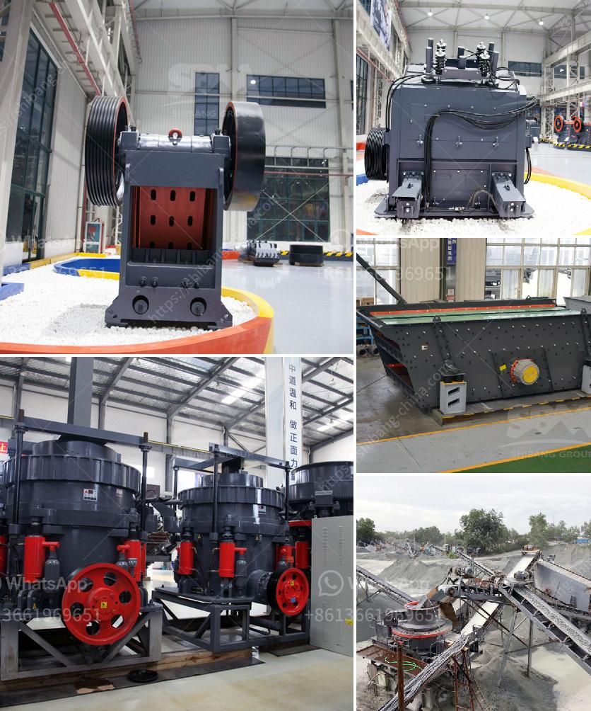

<h3>stone crusher machine made in united states for sale</h3>
Stone crusher is an essential equipment in mining machinery, and it is widely used in the mining industry. With the development of technology and the improvement of materials’ quality, the performance of the crusher has been continuously improved. Stone crushing machine is used to crush large-sized rocks into fragments by the ways of extruding, splitting, bending, impacting and rolling. Commonly used stone crushing machines are stone jaw crusher, stone cone crusher, hammer stone crusher, roll stone crusher and stone impact crusher, etc.

Stone crusher machine made in United States has different features and advantages and it is widely used in rock crushing process plant. Depending on the clients’ production needs, specialists from Zenith will design the specific stone crusher machine. The desired capacity and final size can be chosen according to the practice situation. It will work with high efficiency and productivity, low energy consumption, and strong wear resistance to meet the various demands of clients’ requirements.

Stone crusher machine made in United States mainly includes jaw crusher, impact crusher, cone crusher, hammer crusher, VSI crusher and mobile crusher etc. It can produce aggregate and artificial sand by hard limestone, granite, basalt, pebble, metallurgical slag and artificial sand making, power, transportation and other industrial sectors. It is widely used to crush variety of stones or ores with different hardness in medium and fine crushing as well as various ores and rocks, such as quartz, granite, limestone, slag, pebble, cement clinker, etc.

The USA stone crusher machine has stable performance, reasonable design, convenient operation and maintenance, low energy consumption, wear resistance, long service life, and low cost per ton. It is widely used in mining, metallurgy, building materials, road, railway, water conservancy, chemical industry and other industries. Crushing materials: limestone, calcium carbide, hard rock, shale, basalt, river stone, blue stone, iron ore, copper, gold ore, etc.

Stone crusher machine is supported by advanced technology, long service life, energy-saving and environmental protection. With the increase in production scale, stone crusher machines will be used widely. There are many types of stone crusher machine including jaw crusher, impact crusher, cone crusher, sand making machine, hammer crusher and mobile crusher plant etc. Following is research on their various parameters.

In conclusion, stone crusher machines of various types are widely used in mining, metallurgy, building materials, highways, railways, water conservancy, and chemical industries. Choosing suitable stone crusher machines should be based on the properties and characteristics of the materials to be crushed to ensure the efficiency and durability of the equipment. Stone crusher machine made in United States for sale has been exported to different countries all over the world, such as United States, Canada, Australia, Saudi Arabia, Indonesia, Pakistan, Peru, Mexico etc. While Zenith has developed advanced rock crusher machine technology, which has greatly expanding the concept of crushing operations field.
<h3>Contact us</h3><ul><li><strong>Whatsapp:&nbsp;<a href="https://wa.me/8613661969651">+8613661969651</a></strong></li><li><a href="https://swt.shibang-china.com/?git&amp;zhl&amp;stone crusher machine made in united states for sale"><strong>Online Service(chat now)</strong></a></li></ul><h3>Related</h3><ul><li><a href='mining and quarrying machinery and equipment.md'>mining and quarrying machinery and equipment</a></li><li><a href='business plan for small scale chrome mining.md'>business plan for small scale chrome mining</a></li><li><a href='limestone grinding technology and.md'>limestone grinding technology and</a></li><li><a href='stone crusher machine price in kenya.md'>stone crusher machine price in kenya</a></li><li><a href='financial projections for a ore mining company.md'>financial projections for a ore mining company</a></li></ul>