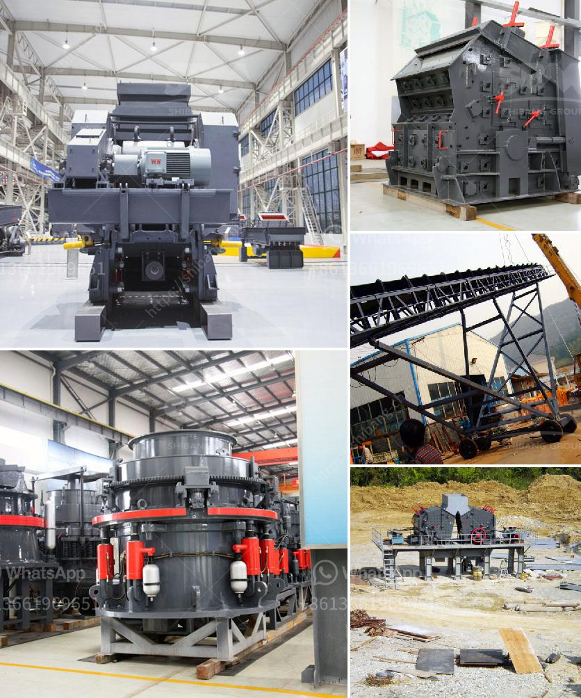

<h3>stone crusher machine pr ice in nepal</h3>
The presence of a stone crushing machine in the industrial sector in Nepal has created several job opportunities for the locals as well as the foreign tourists. Industry Overview:

A stone crushing machine is an automatic or semi-automatic machinery that is used widely to reduce large rocks into rock dust, smaller rocks, sand of gravel. This device is used in mining, sand making & stone quarries. Posted by Tradeindia user (11-09-2020)

Nepal, being a landlocked country, lacks the natural resources used to produce construction materials. This implies that importing construction items, mainly cement, gravel, and crushed stones, is inevitable. To sustain the construction industry and infrastructural development, stone crushing is necessary. It is estimated that there are over 12,000 stone crusher units in Nepal.

The demand for aggregates is soaring, with rapid urbanization and infrastructure development projects in full swing. In order to meet the increasing demand, government has invested a lot of money in the development of basic infrastructure such as roads, bridges, and more. This has further promoted the growth of the stone crusher industry.

In India, industrialist Mukesh Ambani has announced an investment of 2.5 lakh crores (approximately in NPR 4 trillion) in the telecom and infrastructural sectors in Nepal. This investment will bring immense growth opportunities for the stone crusher industry in Nepal.

According to the report on the future of Nepal's industrial structures, the major industries predominantly rely on construction products. The development of roads, bridges, and housing projects creates a large demand for aggregate materials. These materials are produced by stone crushers, which generate huge quantities of dust and fine particles.

The excessive dust pollution caused by these stone crushers is a serious issue that adversely affects the health of the population in the vicinity of the crushers. To tackle this problem, the government of Nepal has recently introduced strict regulations, specifications, and standards on stone crushing.

Over the past few years, the government's attention has been drawn towards the environmental issues caused by the stone crusher machines and plants. It has set specific standards and guidelines to minimize environmental pollution.

The price of stone crusher machines in Nepal still remains expensive but they deliver effective performance and are suitable for the large scale crushing operations. The primary crushing machine, the stone crusher machine, is used to break down the large scale rocks into smaller rocks and fine powder.

Stone crusher machines are widely used in mining, smelting, building materials, highways, railways, water conservancy and chemical industries. There are many types of stone crusher machines produced by renowned companies and each of them has different performance, features, and price. Some of the most popular varieties are spring cone crusher, symons cone crusher, single-cylinder cone crusher, multi-cylinder hydraulic cone crusher, and more.

Different machines cater to different needs, so it is essential to consider the type of stone crusher machines you require before making a purchase. That being said, it is important to choose the best machine with the desired performance and price.

In conclusion, the stone crusher machine in Nepal is used for crushing various hardness rocks into smaller particle sizes. With an aim to fulfill different crushing needs, the crusher machines are equipped with various features and specifications. The price of different crushing machines varies depending on the specifications and models.
<h3>Contact us</h3><ul><li><strong>Whatsapp:&nbsp;<a href="https://wa.me/8613661969651">+8613661969651</a></strong></li><li><a href="https://swt.shibang-china.com/?git&amp;zhl&amp;stone crusher machine pr ice in nepal"><strong>Online Service(chat now)</strong></a></li></ul><h3>Related</h3><ul><li><a href='used crusher for sale in jamaica.md'>used crusher for sale in jamaica</a></li><li><a href='cost of 500 tonnes per day cement plant ecuador.md'>cost of 500 tonnes per day cement plant ecuador</a></li><li><a href='regulatory conveyor belts.md'>regulatory conveyor belts</a></li><li><a href='types of grinding mills.md'>types of grinding mills</a></li><li><a href='mobile crusher manufacturers.md'>mobile crusher manufacturers</a></li></ul>