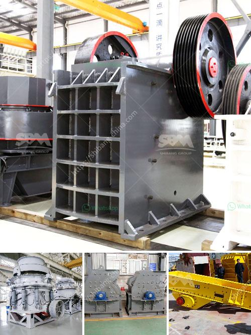

<h3>stone crusher machine price in kenya</h3>
Stone crusher machine is widely used in various industries such as mining, road and railway construction, building construction, water conservation and chemical industry etc. It could crush kinds of minerals and rocks with compression strength less than 320MPa, such as quartz, granite, basalt, limestone, river stone, sandstone, shale, iron ore, copper ore, gold ore etc.

Stone crusher machine often relies on impact crusher or jaw crusher to process the raw materials. With the booming development of construction industry, stone crusher machines are more and more needed. In Kenya, the stone crushing industry has been growing rapidly due to increasing demand from the construction industry and the present emphasis on developing the country’s infrastructure (e.g., road building). Though reliable statistics are lacking for this industrial sector due to its informal nature, it is estimated that there are more than 12,000 stone crushers in the country.

The stone crusher market in Kenya is growing rapidly due to the increasing demand for construction materials and the expanding infrastructure projects across the country. The Kenyan government has also embarked on various construction projects such as bridges, roads, expressways, and dams, which has boosted the demand for stones and sand. Therefore, this has propelled the demand for stone crushers and other crushing equipment.

As a stone crusher machine supplier in Kenya, I greatly recommend HXJQ(China Hongxing Machinery), which has many years of experience in the crushing industry. Their stone crusher machines are reliable and efficient, and they can ensure a high level of productivity. Moreover, their prices are relatively low compared to other companies. This is due to the fact that they manufacture and sell their machines directly to customers, bypassing middlemen.

The price of stone crusher machines in Kenya depends on various factors, such as the ownership of the mine, the raw materials involved, the manpower required to operate the machines, and the geographical location of the mine. The cost of stone crusher machines in Kenya is also influenced by the technological level of the machines.

For example, if the crushing process involved the use of a stone crusher machine with low technological level, the cost of stone crusher machines in Kenya would be medium or even low. But with the growth of the industry, the technology of stone crusher machines in Kenya has gradually increased.

More advanced crushing equipment can produce more finished products with less intermediate crushing, which reduces the cost of secondary crushing. In addition, the European version of the Pew jaw crusher machine and micro hammer crusher can be used for coarse crushing and fine crushing of stones. These advanced machines have shorthead and standard head types, which not only have high crushing efficiency, but also save production cost.

In conclusion, as the market demand for stone crusher machines in Kenya is continuously increasing, the price of simple stone crusher machines is quite high, but those stone crusher machines with more advanced technology and higher crushing efficiency have a higher price. In the future, the Kenyan government will promote the development of infrastructure projects in order to shorten the supply and demand gap of construction materials. Thus, the stone crusher machine industry in Kenya will become even more prosperous.
<h3>Contact us</h3><ul><li><strong>Whatsapp:&nbsp;<a href="https://wa.me/8613661969651">+8613661969651</a></strong></li><li><a href="https://swt.shibang-china.com/?git&amp;zhl&amp;stone crusher machine price in kenya"><strong>Online Service(chat now)</strong></a></li></ul><h3>Related</h3><ul><li><a href='conveyor belts contacts.md'>conveyor belts contacts</a></li><li><a href='gold mining equipment for sale in uganda.md'>gold mining equipment for sale in uganda</a></li><li><a href='crush granite machine.md'>crush granite machine</a></li><li><a href='caco3 manufacturing process.md'>caco3 manufacturing process</a></li><li><a href='german stone grinding machine manufacturer.md'>german stone grinding machine manufacturer</a></li></ul>