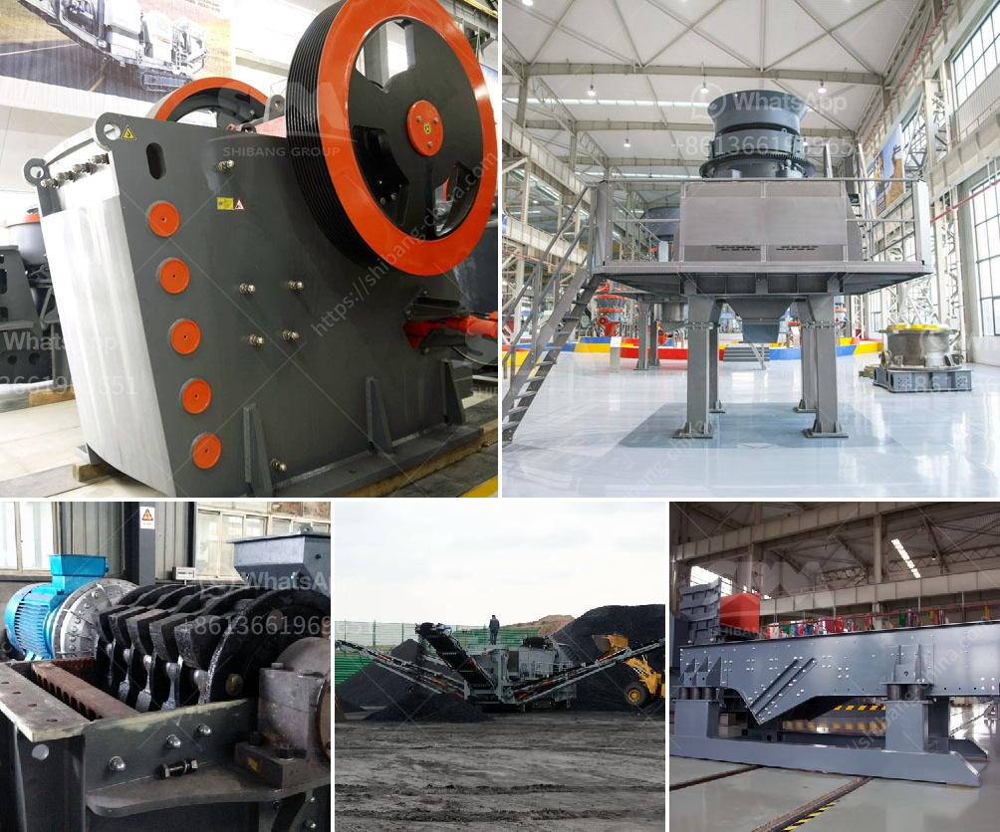

<h3>stone crusher machine price list zambia</h3>
Stone crusher machine price list in Zambia is an essential piece of equipment for you. At Alibaba.com, you can find a great selection of stone crusher machine price list in Zambia machines that work precisely and can ease your work greatly. Stone crusher machine price list in Zambia machines deliver high-volume screening results and are inevitable for the minerals separation. You can find these machines for lucrative deals and periodical offers. 

The stone crusher machine price list in Zambia incorporates all the equipment together on one truck, which has high chassis, narrower body compared with other trucks, this ensures the crushing plant be easily transported on highways and moved to crushing sites, so it is able to achieve on-site crushing without material transporting from one place to another place.

The stone crusher machine price list in Zambia can process a variety of ores, rocks (iron ore, limestone, copper ore, etc.), building materials, construction waste, glass, cement, clinker, and some metal. It can also be used for crushing and shaping soft or middle-hard or extremely hard materials widely applied to pebble, rocks (limestone, granite, basalt, dolerite, andesite), iron ore tailings, artificial sand making of stone chips.

Through the combination of different models, it can form a powerful crushing line and meet different requirements of customers. With various specifications, it can screen, crush and separate the construction waste according to the different sizes to meet the income needs of different customers.

The stone crusher machine price list in Zambia has been developed with advanced crushing technology and considered as the leading stone crusher machine manufacturer in Zambia. Our stone crusher machine price list in Zambia machine have been exported to over 100 countries and areas, such as Southeast Asia, Africa, India, South America, etc.

If you are interested in our stone crusher machine price list in Zambia, or you want to get more information about our crushing equipment in Zambia, you can contact our service staff, we will solve your problem as soon as possible. In addition, if you want to know more about different types of stone crushers and their prices, please consult our customer service for free. You can also send an email to [email protected]. We will reply to you within 24 hours.

In conclusion, stone crusher machine price list in Zambia can bring benefits for various industries, such as metallurgy, mining, chemical, cement, construction, refractory materials, and ceramics. Due to the gradual depletion of natural sand resources and the booming construction industry, machine-made artificial sand becomes even more popular in the market. Various types of machine-made sand production lines with different classifications can meet various requirements of customers and tailor-made solutions. So, if you need stone crushers, please contact us and we are willing to customize a solution for you.
<h3>Contact us</h3><ul><li><strong>Whatsapp:&nbsp;<a href="https://wa.me/8613661969651">+8613661969651</a></strong></li><li><a href="https://swt.shibang-china.com/?git&amp;zhl&amp;stone crusher machine price list zambia"><strong>Online Service(chat now)</strong></a></li></ul><h3>Related</h3><ul><li><a href='crushing machine malaysia.md'>crushing machine malaysia</a></li><li><a href='stone crushers nigeria.md'>stone crushers nigeria</a></li><li><a href='mobile crusher price and option.md'>mobile crusher price and option</a></li><li><a href='cement clinker processing machine.md'>cement clinker processing machine</a></li><li><a href='stone processing equipment turkey company.md'>stone processing equipment turkey company</a></li></ul>