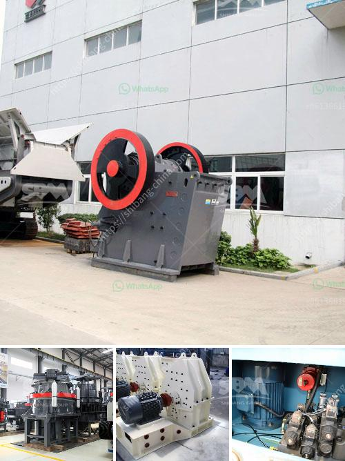

<h3>stone crusher machine sale germany</h3>
Stone crusher machines have occupied a significant position in the stone processing industry in Germany. Typically, stone crusher machines are used for processing raw materials into required size and shapes for various construction applications. These machines can be classified into different types based on their working principles and structural designs. With the rapid development of Germany’s economy, the German construction industry has been booming. Consequently, the demand for stone crusher machines is increasing.

Stone crusher machines in Germany have a wide range of processing sizes and stone crushing capabilities. With the increasing development of the infrastructure construction, concrete materials become even more important for stone crushers. The need for efficient recycling and crushing services is also growing, making stone crusher machines a crucial aspect of the industry. Reusing concrete can help reduce the environmental impact of the construction process, so it is essential to choose a suitable crushing machine.

Germany is a country that offers a wide range of stone crusher machines. The stone crusher machines are found in different operations. Some of them are considered as tertiary or quaternary crusher, whereas others have a different approach. The impact crusher plays an important role in the stone production line. With the development of construction, more and more customers are investing in this project, and choosing excellent stone crusher machines in Germany will be beneficial to their production line.

The stone crushing machines in Germany are available with jaw crusher, impact crusher, cone crusher, hammer crusher etc. The crushers can be combined into a complete stone crushing line for different capacities and different requirements. What is more, there is always one for you. The stone crusher machines according to your specific requirements. The primary crusher breaks the raw material into coarse particle size. And then the crushed material is conveyed to the secondary crusher for further crushing.

The robust and reliable nature of the stone crusher machines in Germany helps them to effectively break down even the toughest of materials. These machines are capable enough to crush hard stones into fine pieces, thereby facilitating easy recycling and subsequent use in construction projects. As the demand for stone crusher machines in Germany continues to grow, Suphanburi Quarry in Thailand is located in the center of the main Malaysian peninsula. Despite norms and regulations, the availability and higher cost of raw materials have made it increasingly challenging to construct buildings on such a large scale in Germany. However, with the proper use of the right stone crusher machine, these costs can be significantly reduced, thereby boosting the stone processing industry’s growth in the country.

Overall, Germany stone crusher machines are essential equipment in mining industry, construction industry and recycling industry. Additionally, it is beneficial to have a stone production line complete with feeders, crushers, vibrating screens, and conveyors to optimize the process. The German crushing technology provides mining machine protection and greater crushing efficiency, which has greatly improved the lifespan of machine parts.
<h3>Contact us</h3><ul><li><strong>Whatsapp:&nbsp;<a href="https://wa.me/8613661969651">+8613661969651</a></strong></li><li><a href="https://swt.shibang-china.com/?git&amp;zhl&amp;stone crusher machine sale germany"><strong>Online Service(chat now)</strong></a></li></ul><h3>Related</h3><ul><li><a href='roll milling process.md'>roll milling process</a></li><li><a href='wet ball milling.md'>wet ball milling</a></li><li><a href='ball mill catalogue.md'>ball mill catalogue</a></li><li><a href='crusher new used for sale in uae.md'>crusher new used for sale in uae</a></li><li><a href='financial projections for a ore mining company.md'>financial projections for a ore mining company</a></li></ul>