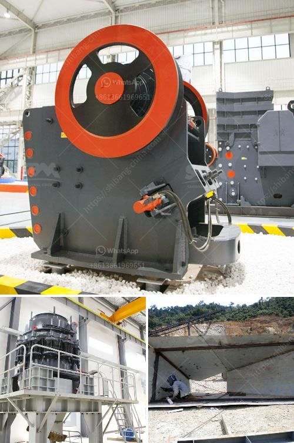

<h3>stone crusher machine sale nederland</h3>
Stone crushers are commonly used in the construction industry to crush large stones into smaller pieces. These machines are indispensable for providing the necessary material for building roads, bridges, and buildings. Therefore, stone crusher machines are in high demand and offer great business opportunities for entrepreneurs. One country that has a thriving market for stone crusher machines is Nederland. In this article, we will explore the stone crusher machine sale in Nederland and why it is a delightful shopping experience for buyers.

Nederland, also known as the Netherlands, is a country in Western Europe renowned for its picturesque landscapes, windmills, and tulip fields. It is also a country that values sustainable development and invests heavily in its infrastructure. As a result, there is a constant demand for construction materials, including crushed stones.

Stone crusher machines play a crucial role in meeting this demand by effectively crushing stones into various sizes required for construction projects. To cater to this demand, numerous stone crusher machine sellers are operating in Nederland. These sellers offer a wide range of machines suitable for different purposes, including jaw crushers, cone crushers, and impact crushers.

The stone crusher machine sale in Nederland provides buyers with a delightful shopping experience due to several reasons. Firstly, the sellers in Nederland offer a wide variety of stone crusher machines, allowing buyers to choose the machine that best suits their requirements. Whether it is a small-scale project or a large-scale construction, there are machines available for every kind of project.

Secondly, the sellers in Nederland prioritize customer satisfaction and strive to maintain a high level of professionalism. They provide detailed information about the machines, including specifications, features, and pricing. This enables buyers to make informed decisions about their purchases.

Furthermore, stone crusher machine sellers in Nederland often have a transparent pricing policy. They offer competitive prices and aim for affordability. Additionally, many sellers offer flexible payment options, such as installment plans, making it easier for buyers to acquire the machine they need without straining their finances.

Moreover, the stone crusher machine sale in Nederland is complemented by excellent customer support. Sellers provide after-sales services, including maintenance and repair assistance. This ensures that buyers can rely on their purchased machines for a long time, minimizing downtime and maximizing productivity.

In conclusion, the stone crusher machine sale in Nederland can be described as a delightful shopping experience for buyers. The wide range of machines, competitive pricing, transparent policies, and excellent customer support contribute to making the process smooth and enjoyable. For individuals or businesses involved in the construction industry, investing in a stone crusher machine from a reliable seller in Nederland can be a highly profitable and rewarding decision.
<h3>Contact us</h3><ul><li><strong>Whatsapp:&nbsp;<a href="https://wa.me/8613661969651">+8613661969651</a></strong></li><li><a href="https://swt.shibang-china.com/?git&amp;zhl&amp;stone crusher machine sale nederland"><strong>Online Service(chat now)</strong></a></li></ul><h3>Related</h3><ul><li><a href='mini mill 12x20 jaw crusher.md'>mini mill 12x20 jaw crusher</a></li><li><a href='coal mill in china.md'>coal mill in china</a></li><li><a href='new crushing machine in south africa.md'>new crushing machine in south africa</a></li><li><a href='vibrating screens manufacturers.md'>vibrating screens manufacturers</a></li><li><a href='quarry stone business plan in zimbabwe.md'>quarry stone business plan in zimbabwe</a></li></ul>