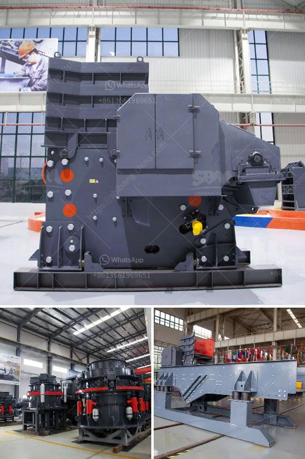

<h3>stone crusher machine south africa</h3>
Stone Crusher Machine South Africa is the largest economy in Africa, and it is a region with abundant mining resources. For the exploitation of these resources, it is necessary to crush stones or other mining products into smaller sizes for further processing. In order to fulfill the growing demands of various industries, the stone crusher machine in South Africa has experienced a boom period of development.

The stone crusher machine in South Africa mainly includes jaw crusher, cone crusher, impact crusher, hammer crusher, ball mill, Raymond mill, counterattack crusher, vertical shaft impact crusher and so on. Among them, the jaw crusher is the most common equipment. Why does the jaw crusher so popular in South Africain? Jaw crusher is the primary crushing equipment, but also the first choice for primary crushing equipment, but also a highly efficient, energy-saving crushing equipment. The jaw crusher equipment is mainly used for a variety of ores and medium-grained bulk materials crushing, crushing compression strength is not more than 320Mpa available materials.

So, no matter what the production line will always use it. In the recent year, a new generation of jaw crusher has appear, and it is the most advanced and broken equipment into all kinds of hard and abrasive crusher, such as the broken granite, basalt and other material hardness of the quarry stone really is not small, this is due to the reason that our jaw crusher material is laid out under the jaw plate crushing cavity, the material into small pieces, jaw crusher, according to the crushing force are becoming more and more small, and finally its small fragments can be discharged from the discharge opening. In this way, the jaw crusher in South Africa's production line plays an important role in producing crushed stones. The crushed stones are screened by a circular vibrating screen, and the larger particles are returned to the jaw crusher for re-crushing. The crushed stones with the desired particle size are conveyed to the sand making machine for further processing.

Stone crusher machine price in South Africa is influenced by many factors, including: stone crusher machine price in South Africa; customer's demand on production; the crusher configuration, etc. For example, the stone crusher machine is also divided into coarse, medium and fine stone crusher machine price in South Africa; according to the different needs of users to tailor-made;

Technical advantages of stone crusher machine price in South Africa: 1. Advanced crushing principle, high production efficiency; 2. Simple structure, convenient maintenance; 3. The final product is cubic, the size is adjustable and uniform; 4. Intelligent control, saving time and effort, design a 4H headquarters, one-click operation; 5. Environmental protection, less dust, low noise; 6. Stable operation, high reliability, almost zero failure rate;

In conclusion, the stone crusher machine in South Africa has been well developed and is widely used in many fields, such as mining, metallurgy, water conservancy, coal and chemicals. There are many types of stone crusher machines in South Africa, and different stone crusher machines have different functions, crushing machinery refers to the equipment that breaks stones from large blocks into pieces that meet specific requirements. In general, gravel machinery includes: jaw crusher, impact crusher, hammer crusher, cone crusher, ZS vertical shaft impact crusher, etc. The working principle is set: the crushing principle is “stone beating”, so that the rotor and cavity work in the same direction to reduce the probability of stone being hit by the upper rotor and the crushing cavity. The capacity of stone crusher machine determines the working efficiency. Therefore, it deserves increased attention in the selection of models. Note that even the best quality stone crusher machine, if the wrong is no use, so during the selection process must be carefully owned stone crusher machine.
<h3>Contact us</h3><ul><li><strong>Whatsapp:&nbsp;<a href="https://wa.me/8613661969651">+8613661969651</a></strong></li><li><a href="https://swt.shibang-china.com/?git&amp;zhl&amp;stone crusher machine south africa"><strong>Online Service(chat now)</strong></a></li></ul><h3>Related</h3><ul><li><a href='quartz processing machine up to 300 mesh.md'>quartz processing machine up to 300 mesh</a></li><li><a href='feldspar crusher impactor.md'>feldspar crusher impactor</a></li><li><a href='hammer mill for sale in south africa.md'>hammer mill for sale in south africa</a></li><li><a href='coal beneficiation process.md'>coal beneficiation process</a></li><li><a href='high purity quartz crusher processing.md'>high purity quartz crusher processing</a></li></ul>