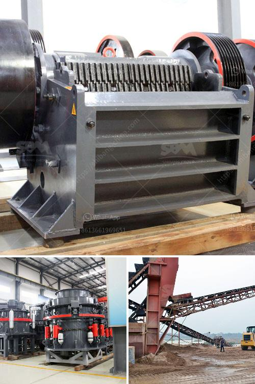

<h3>stone crusher machines</h3>
A stone crusher machine is built to reduce large rocks into smaller rocks, rock dust, or gravel. Stone crusher machine is widely known as Crushers, and they are used to reduce the size, change the form of waste minerals so they can easily be recycled or disposed of properly. Crusher is one of the primary machines to be used in the mining industry.

Crushing is the process of reducing the size of materials so that they can be further processed. In addition to being used in the mining industry, crushers are also suited for many other industries that require size reduction. They can handle materials such as coal, gilsonite, limestone, cement, copper, sand, gravel, and more.

So, how do these stone crushing machines work? Different materials, like rocks and stones, are passed through a machine called a crusher which ultimately reduces the material into smaller pieces. These machines are usually powered by electricity or diesel and are known as fixed crushers.

Jaw Crusher was first introduced by Eli Whitney Blake in 1858. It consists of a main frame and two plates that move like jaws. Both jaws have a huge compressive force, and then the rock is pulled between a stationary plate and a movable plate. The crushed rocks fall from the jaw to the conveyor below, which moves them to further processing. Jaw crushers are most commonly used in mines and quarries, as primary crushers.

An impact crusher machine uses impact force to crush materials in a crushing chamber instead of pressure. The materials remain in a cage that has openings of specific sizes to allow the materials of the desired size to escape. So, once the rocks have been crushed to the desired size, they will exit the crusher.

Jaw crusher is mainly used for primarily crushing the raw materials, so that is also called primary jaw crusher or primary crushers.

Jaw crusher is one of the most important crushing machines in the stone crushing production line. It can be not only used for crushing stone materials, pebble and coal and be called stone jaw crusher, but used for manufacturing cement aggregate.

Impact crusher is also called stone impact crusher and impact crusher machine, which is a new type of highly efficient crushing machine with such features of small size, simple construction, big crushing ratio, low energy consumption, high production capacity, even product granularity and selective ore crushing.

Impact crusher provides a better solution in dealing with medium-hardness materials, and it is widely used for the fine and medium crushing of many kinds of stone materials such as limestone, clinker, slag, coke, coal, and others.
<h3>Contact us</h3><ul><li><strong>Whatsapp:&nbsp;<a href="https://wa.me/8613661969651">+8613661969651</a></strong></li><li><a href="https://swt.shibang-china.com/?git&amp;zhl&amp;stone crusher machines"><strong>Online Service(chat now)</strong></a></li></ul><h3>Related</h3><ul><li><a href='type of product manufactured vertical mills of india.md'>type of product manufactured vertical mills of india</a></li><li><a href='crusher machine business.md'>crusher machine business</a></li><li><a href='flow diagram by gypsum process.md'>flow diagram by gypsum process</a></li><li><a href='quartz stone lining machinery.md'>quartz stone lining machinery</a></li><li><a href='used brick making machine for sale.md'>used brick making machine for sale</a></li></ul>