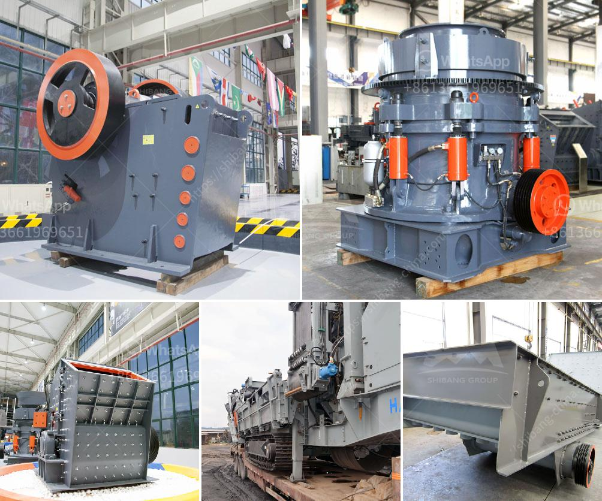

<h3>stone crusher manufacturers in ranchi</h3>
Stone crushers are commonly used on construction sites and in stone quarries to crush large stones into smaller pieces. Crushed stone has a variety of purposes but is often used to make level surfaces, provide drainage under roads and buildings, or to produce aggregate or manufactured sand.

Stone crushers are very important equipment in construction industry. They are used for crushing stones into small pieces to make concrete and other materials used in construction. The stone crushing industry is growing rapidly in Ranchi, the capital city of Jharkhand, with increasing demand for stone crushers.

As a stone crusher manufacturer in Ranchi, we have been successfully catering to the diverse requirements of our esteemed clients since 1974. We have grown in leaps and bounds in the industry owing to our continuous efforts to provide innovative and technologically advanced products. Our comprehensive range of stone crushers includes a wide range of models, sizes, and capacities to meet the specific requirements of our clients.

Quality and reliability are the guiding principles behind our stone crushers manufacturing process. We source the best quality raw materials, such as high-grade steel and components, to ensure durability and extended lifespan of our products. Our state-of-the-art manufacturing unit is equipped with the latest machinery and technology, enabling us to deliver products of the highest quality.

Apart from producing superior quality stone crushers, we also offer personalized after-sales services to our clients. Our team of experienced technicians is always available to provide prompt assistance and support, ensuring the smooth functioning of our products. We also undertake regular maintenance and servicing of our crushers to prevent any operational issues.

At our manufacturing unit in Ranchi, we have developed a research and development division dedicated to improving our products and introducing new features. Our constant focus on innovation allows us to stay ahead in the industry and deliver cutting-edge solutions to our clients.

In conclusion, as a stone crusher manufacturer in Ranchi, we are committed to delivering high-quality stone crushers that are durable, reliable, and efficient. Our products are designed to meet the specific requirements of our clients and are backed by excellent after-sales services. With our focus on innovation and continuous improvement, we are well-poised to cater to the growing demand for stone crushers in Ranchi.
<h3>Contact us</h3><ul><li><strong>Whatsapp:&nbsp;<a href="https://wa.me/8613661969651">+8613661969651</a></strong></li><li><a href="https://swt.shibang-china.com/?git&amp;zhl&amp;stone crusher manufacturers in ranchi"><strong>Online Service(chat now)</strong></a></li></ul><h3>Related</h3><ul><li><a href='stone crushets for sale south aftica.md'>stone crushets for sale south aftica</a></li><li><a href='hammer mills for sale in zimbabwe.md'>hammer mills for sale in zimbabwe</a></li><li><a href='200mm crusher sieve opening sizes.md'>200mm crusher sieve opening sizes</a></li><li><a href='standard operating procedure of vibrating feeder.md'>standard operating procedure of vibrating feeder</a></li><li><a href='hammer mills hammer mills.md'>hammer mills hammer mills</a></li></ul>