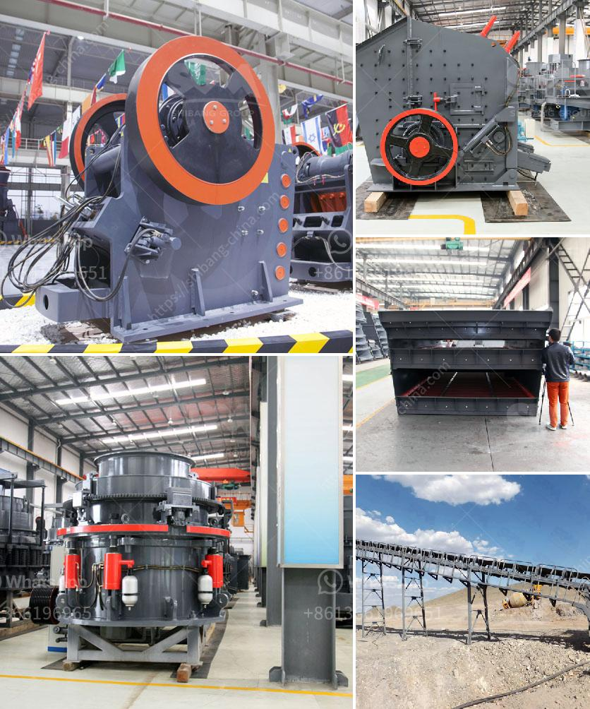

<h3>stone crusher output</h3>
Stone crusher is a unique machine that has the ability to crush rocks of any size and hardness into a uniform and usable product. It can crush rocks into smaller sizes as per requirement and also can aim to produce the desired output particle size. The machine has two types, which are fixed jaw crusher and mobile jaw crusher.

The output of the stone crusher is determined by factors such as the type of stone, the size of the feed, and the size of the discharge. The size of the input can influence the choice of output size of the crushing equipment. For example, if the feed size of the stone is smaller than the output size recommended by the engineers, a double roll crusher can be adopted for primary crushing to reduce the feed size to the required size.

Of course, there are also different requirements for output size depending on the usage of the stone. For example, in highway construction, it is necessary to produce a cubical aggregate shape for better compaction and stability. In this case, a vertical shaft impact crusher can be used to shape the aggregate particles into a more uniform and rounded shape.

The output capacity of a stone crusher is determined by the amount of material crushed per hour. For example, if the crusher is intended to handle 200 tons per hour, then it is expected to generate an average of 75 tons per hour. A higher output will require a larger model of crusher, while a smaller model crushes less amount of material in one hour.

In conclusion, the stone crusher machine has been developed in a modern way and is able to convert large rocks into a uniform and usable product. Output size can be adjusted and the machine can aim to produce the desired product size according to the specific requirements. It is important to consider the input size and the required output size when choosing the suitable stone crusher for an application.
<h3>Contact us</h3><ul><li><strong>Whatsapp:&nbsp;<a href="https://wa.me/8613661969651">+8613661969651</a></strong></li><li><a href="https://swt.shibang-china.com/?git&amp;zhl&amp;stone crusher output"><strong>Online Service(chat now)</strong></a></li></ul><h3>Related</h3><ul><li><a href='rock crusher for sale in botswana.md'>rock crusher for sale in botswana</a></li><li><a href='feldspar stone processing plant.md'>feldspar stone processing plant</a></li><li><a href='crushing powder machine germany.md'>crushing powder machine germany</a></li><li><a href='ball grinding machine manufacturer in india.md'>ball grinding machine manufacturer in india</a></li><li><a href='pin for an industrial hammer mill.md'>pin for an industrial hammer mill</a></li></ul>