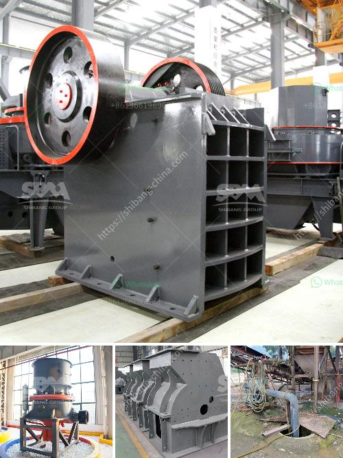

<h3>stone crusher permission maharashtra</h3>
Stone crushing industry is a pivotal industrial sector in the country. The crushed stone is used as a raw material for various construction activities such as construction of roads, bridges, buildings and canals. Over the last 10 years, the Construction sector has been registering strong growth rates in the range of 7-8%. Housing and construction is one of the major drivers of growth in more than 40 allied industries including STONE CRUSHING.

In addition, for the building of roads, flyovers and bypasses, there is a mass and consistent need of crushed stone across the country. Several projects are in progress and are being commenced shortly which will have high demand of crushed stone all over the country.

Stone crusher units are not alone. Along with these plants, stone mining also associated. In fact, stone mining is the primary activity, and the crushing plant is the secondary activity that can be considered. Raw materials used for crushing unit

Coal, Stone, Granite, limestone, Basalt, River stone, andesite calcite, abrasive rocks, glass, and ferrous material used for the crushing purpose. Stone Crusher plant Capacity

The stone crusher plant will available from 50 TPH to 600 TPH (ton per hour). The plant can produce the 8 variants of material. Just to get the different variant material you also need to put the screening plant that just separates the different materials according to client or market demand. Stone Crusher plant works

Raw Material processed through the vibrating feeder to crusher gradually and crusher crushed the material into respective pieces. From Crusher material conveyed to belt conveyor for secondary crushing before went on vibrating screen plant. Vibrating screen plant separates the quality and qualified material to final products. And unqualified material carried back to stone crusher and reprocessed into different sizes. In addition, the production line may also be required to be separated with certain sizes which may require a crushing machine for primary crushing. Moreover, secondary crushing and screening work is necessary to ensure the quality of aggregates.

A large number of stone crusher plants in Maharashtra are being installed without permission or against the rules. They are causing serious environmental pollution and damage to the infrastructure in the state. There are many illegal and unauthorized stone crusher units in Maharashtra that can create health hazards to the workers. The dust generation is also high in many of the units. Proper on-site sanitation measures should be taken up. The stone crusher industry must be put to operation only after valid permission is granted by the government.

Responsible authorities should take proper actions in conducting detailed feasibility studies to determine the environmental impact of the activity. Proper transparency and accountability in the permitting process should be ensured for obtaining environmental clearance. The government should take strict action against the illegal and unauthorized stone crusher units to protect the environment and public health.

Stone crusher permission maharashtra should not be compromised since the other category of industries also do not allow such permissions. It is mandatory to have proper permissions lest the units will be forced to close down in case they violate the norms. Many of the crushers are still working in Maharashtra without any permission. Stone crusher units may also be established on mining leases aller obtaining prior environmental clearane for the purpose and/or setting up of stone crusher units may be allowed to function till the grant or refusal of Certificate of compliance of safe zone under sub-section (4) by the Authority or till three months from the date of application, whichever is earlier.

In conclusion, stone crusher permission Maharashtra can be modified to regulate the pollution caused by the stone crusher industry and may also be helpful in preventing health hazards faced by the workers. Key Words: Pollution - Stone Crushing Industry - Noise - Pollution - Control boards - Environmental Impact - Assessment - State pollution Control board.
<h3>Contact us</h3><ul><li><strong>Whatsapp:&nbsp;<a href="https://wa.me/8613661969651">+8613661969651</a></strong></li><li><a href="https://swt.shibang-china.com/?git&amp;zhl&amp;stone crusher permission maharashtra"><strong>Online Service(chat now)</strong></a></li></ul><h3>Related</h3><ul><li><a href='how to build a hammer mill.md'>how to build a hammer mill</a></li><li><a href='conveyor belt manufacturer in uae.md'>conveyor belt manufacturer in uae</a></li><li><a href='copper processing plant.md'>copper processing plant</a></li><li><a href='quartz making machine germany.md'>quartz making machine germany</a></li><li><a href='ball mill suppliers uk.md'>ball mill suppliers uk</a></li></ul>